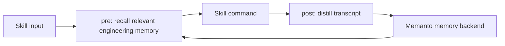

# Claude Code Skills + Memanto

This example shows how Memanto can act as a shared engineering memory layer for
single-purpose Claude Code skills such as `/grill-with-docs`, `/tdd`, and
`/handoff`.

The implementation is intentionally reviewer-safe:

- `local` mode stores memories in a JSONL file and needs no credentials.
- `sdk` mode uses `memanto.cli.client.sdk_client.SdkClient` when
  `MOORCHEH_API_KEY` is available.
- The same lifecycle is used in both modes: recall before a skill runs,
  distill the completed transcript, then remember durable engineering facts.

## Quick Start

```bash
cd examples/claudecode-skills-memanto
python validate.py
python run_demo.py
python -m unittest test_skill_memory.py
```

Expected output:

```text
validation passed
demo complete
```

The demo writes local memories for a first `/grill-with-docs` run, injects the
same architectural decisions into a later `/tdd` run, and reports how many
repeated instructions were avoided.

## Live SDK Mode

```bash
export MOORCHEH_API_KEY=...
python run_demo.py --backend sdk --agent-id claude-skills-demo
```

The SDK backend calls Memanto's `remember` and `recall` primitives directly.
No key is required for validation because the local backend follows the same
interface.

## Generated Skill Wrappers

```bash
python validate.py --write-wrappers ./generated
```

This writes shell wrappers for:

- `grill-with-docs`
- `tdd`
- `handoff`

Each wrapper calls `skill_memory.py pre` before the underlying command and
`skill_memory.py post` after completion. The wrapper is plain shell so it can be
adapted to an existing `mattpocock/skills` checkout without changing the skills
themselves.

## Design



## Demo Transcript

Session 1, `/grill-with-docs`:

```text
Task: Review auth-refresh architecture.
Decision: Keep refresh token rotation in AuthGateway, not React components.
Preference: Use typed Result objects for recoverable API errors.
```

Session 2, `/tdd` with no repeated instructions:

```text
Injected memory:
- Keep refresh token rotation in AuthGateway, not React components.
- Use typed Result objects for recoverable API errors.
```

The second session can write tests using the earlier architectural constraints
without restating them in the current prompt.

## Showcase

In-repo technical showcase: this README plus `run_demo.py` output.
External social posts are optional for technical review, per the issue thread.

/claim #508

