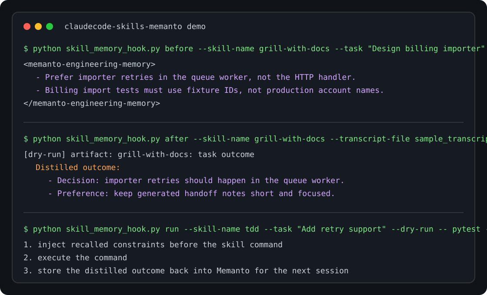

# Claude Code Skills + Memanto

This example demonstrates a lightweight memory bridge for the
`mattpocock/skills` workflow. It lets Memanto act as a global engineering
profile across separate skill executions, so one skill can remember decisions
that another skill uses later.

The bridge has two hooks:

- `before`: recall relevant engineering memories before a skill starts and
  print a compact system-constraint block.
- `after`: distill the completed skill transcript into durable Memanto
  memories, such as architecture decisions, codebase quirks, and style
  preferences.

It is intentionally small: no daemon, no shell magic, and no lock-in to a
specific skill. Any command or slash-skill transcript can be wrapped.

## Why this matters

Skills like `/grill-with-docs`, `/tdd`, and `/handoff` are powerful on their
own, but each terminal session starts with a partial view of the project. This
bridge makes prior decisions portable:

1. `/grill-with-docs` extracts a project decision.
2. The `after` hook stores that decision in Memanto.
3. A later `/tdd` run calls the `before` hook.
4. Memanto recalls the decision and injects it as a concise constraint.

The agent stops asking the user to repeat architectural preferences.

## Files

```text
examples/claudecode-skills-memanto/
|-- README.md
|-- assets/
|   `-- terminal-demo.svg
|-- sample_transcript.md
`-- skill_memory_hook.py
```

## Setup

```bash
pip install -e .

# Configure Memanto once.
memanto agent create claudecode-skills --pattern project \
  --description "Shared memory for Claude Code skills"
```

You need `MOORCHEH_API_KEY` configured for real memory writes. The dry-run mode
below works without credentials and is useful for demos and tests.

## Dry-run demo

```bash
python examples/claudecode-skills-memanto/skill_memory_hook.py before \
  --skill-name grill-with-docs \
  --task "Design the billing import pipeline" \
  --path services/billing/importer.py \
  --dry-run

python examples/claudecode-skills-memanto/skill_memory_hook.py after \
  --skill-name grill-with-docs \
  --task "Design the billing import pipeline" \
  --transcript-file examples/claudecode-skills-memanto/sample_transcript.md \
  --dry-run
```

## Real workflow

Run a skill and store its outcome:

```bash
python examples/claudecode-skills-memanto/skill_memory_hook.py run \
  --skill-name tdd \
  --task "Add retry support to invoice imports" \
  --path services/billing/importer.py \
  --agent-id claudecode-skills \
  -- pytest tests/test_invoice_importer.py -q
```

Use the recalled block at the start of the next skill run:

```bash
python examples/claudecode-skills-memanto/skill_memory_hook.py before \
  --skill-name handoff \
  --task "Summarize invoice importer work" \
  --path services/billing/importer.py \
  --agent-id claudecode-skills
```

Example output:

```text
<memanto-engineering-memory>
- Prefer importer retries in the queue worker, not the HTTP handler.
- Billing import tests must use fixture IDs, not production account names.
</memanto-engineering-memory>
```

Paste that block into the next slash-skill prompt as a system constraint.

## Showcase

The terminal-style showcase below demonstrates the cross-session loop without
requiring reviewer credentials:



The demo shows three reviewable surfaces:

1. A skill starts and receives recalled engineering constraints.
2. A completed transcript is distilled into reusable Memanto memories.
3. The next skill can reuse those decisions instead of asking the developer to
   repeat architecture and style preferences.

External Reddit or X posts can add distribution points for the bounty
leaderboard, but the issue owner clarified that technical review can proceed
without an external social post.

## Submission checklist for the bounty

- Add the implementation in this folder.
- Include this public in-repository showcase link in the PR description.
- Run:

```bash
pytest tests/test_claudecode_skills_memanto_example.py -q
```
