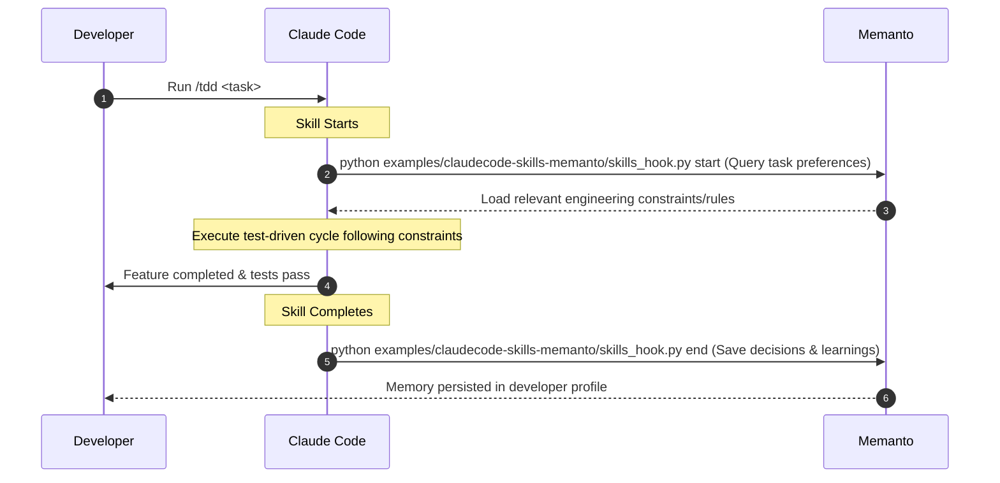

# Memanto + Claude Code Skills: Active Memory Companion

This example demonstrates how to integrate **Memanto** as a global, active memory companion inside the **Claude Code** (or `mattpocock/skills`) developer workflow. 

By wrapping your developer skills (like `/tdd` or `/grill-with-docs`) in Memanto hooks, you completely eliminate **Context Fragmentation**. Your coding agent remembers design choices, styling preferences, and domain guidelines across separate CLI sessions without having to ask the user repeatedly.

---

## 🐜 The Problem: Context Fragmentation

In agentic coding tools like Claude Code, each terminal session and slash command execution is treated as an isolated event:
* If you run `/grill-with-docs` to define a database schema, that context is lost when you invoke `/tdd` in a fresh terminal session.
* The agent has to ask you the same architectural questions over and over, wasting tokens and time.

---

## 🧠 The Solution: Active Memory Hooks

This integration injects a lightweight memory hook at the start and end of the skill's execution lifecycle:



1. **At Skill Startup (Dynamic Injection):** The skill automatically runs `examples/claudecode-skills-memanto/skills_hook.py start`. Memanto retrieves relevant past memories matching the task and injects them as active constraints in the agent's prompt context.
2. **At Skill Completion (Active Ingestion):** The skill runs `examples/claudecode-skills-memanto/skills_hook.py end`, generating a concise summary of the decisions, design choices, and developer preferences learned during this session, saving it back to Memanto for the next call.

---

## 🛠️ Project Structure

```
claudecode-skills-memanto/
├── README.md               # This documentation
├── requirements.txt       # Dependencies (memanto, pydantic)
├── skills_hook.py          # The Python CLI Hook (Start/End commands)
└── skills/                 # Updated Claude Code skill templates
    ├── tdd/
    │   └── SKILL.md        # TDD skill template with Memanto hooks
    └── grill-with-docs/
        └── SKILL.md        # Interview skill template with Memanto hooks
```

---

## 🚀 Getting Started

### 1. Prerequisites

First, ensure you have a Moorcheh API key. You can get one for free at [moorcheh.ai](https://moorcheh.ai/).

Configure the key in your terminal session:
```bash
export MOORCHEH_API_KEY="your-moorcheh-api-key-here"
```

### 2. Install Dependencies

Install the required Python packages:
```bash
pip install -r requirements.txt
```

### 3. Deploy the Skills

Copy the customized skills from the `skills/` directory into your project's local Claude config folder:
```bash
mkdir -p .claude/skills
cp -r skills/* .claude/skills/
```

### 4. Deploy the Hook Script

The skill templates in `.claude/skills/` reference `skills_hook.py` using the path
`examples/claudecode-skills-memanto/skills_hook.py`. You need to copy the hook script
so that path resolves correctly from your **project root**:

```bash
mkdir -p examples/claudecode-skills-memanto
cp skills_hook.py examples/claudecode-skills-memanto/skills_hook.py
```

> **Tip:** If you prefer to keep `skills_hook.py` at the project root and call it directly,
> update the hook commands inside your `.claude/skills/*/SKILL.md` files to use
> `python skills_hook.py` instead of the full relative path.

---

## 📖 Hook CLI Reference

The helper script exposes two commands that orchestrate active memory.
All commands below assume they are run from your **project root**, where
`examples/claudecode-skills-memanto/skills_hook.py` is the canonical path
(matching what the deployed SKILL.md templates invoke automatically).

### 1. Start Hook (Inject Memories)
Queries Memanto for context relevant to the incoming task:
```bash
python examples/claudecode-skills-memanto/skills_hook.py start --skill <skill-name> --task "<task-description>"
```
*   **Result:** Fetches up to 5 matching memory items and outputs them formatted as a clean markdown block. Claude Code will consume this block to ground its actions.

### 2. End Hook (Remember Learnings)
Saves engineering choices and user corrections to the profile:
```bash
python examples/claudecode-skills-memanto/skills_hook.py end --skill <skill-name> --summary "<learnings-and-decisions>"
```
*   **Result:** Analyzes the summary content, dynamically categorizes it (e.g. `preference`, `decision`, `learning`), and stores it in the active session database instantly.
