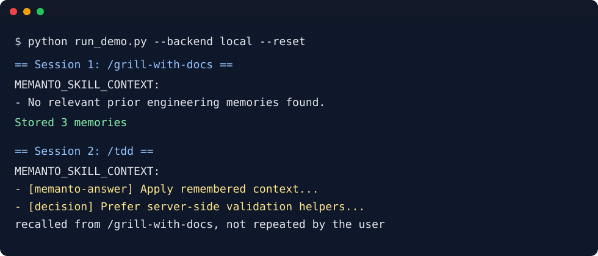

# Claude Code Skills + Memanto

This example shows how Memanto can act as a global memory companion for
`mattpocock/skills`-style command workflows. It captures the result of one
skill run, stores durable engineering memories, and injects only relevant
memories into later skill prompts.

The example is reviewer-safe by default:

- `local` backend stores JSONL memories under `.memanto-local/`
- `memanto` backend uses `memanto.cli.client.sdk_client.SdkClient` when
  `MOORCHEH_API_KEY` is configured
- live mode uses Memanto's `remember`, `recall`, and `answer` primitives:
  `answer` adds a short grounded engineering constraint before the next skill
- no private API keys, prompts, or terminal transcripts are required for the
  offline demo

## Files

```text
examples/claudecode-skills-memanto/
├── README.md
├── requirements.txt
├── skill_memory.py
├── mattpocock_adapter.py
├── run_demo.py
├── benchmark_report.md
├── validate.py
├── test_skill_memory.py
├── demo_transcript.md
└── sample_injected_context.md
```

## Quickstart

```bash
cd examples/claudecode-skills-memanto
python validate.py
python run_demo.py --backend local --reset
python -m unittest test_skill_memory.py
```

Optional live Memanto mode:

```bash
export MOORCHEH_API_KEY=...
python run_demo.py --backend memanto --agent-id claudecode-skills-demo
```

## How It Works

The wrapper has two lifecycle hooks.

`before_skill(skill_name, user_prompt, paths)`:

1. Builds a retrieval query from the skill name, prompt, and touched paths.
2. Recalls matching Memanto memories.
3. Asks Memanto for a concise grounded answer from the same remembered context.
4. Emits a short injected context block for the skill prompt.

`after_skill(skill_name, user_prompt, transcript, paths)`:

1. Extracts durable decisions, preferences, constraints, and artifacts from the
   finished skill transcript.
2. Stores them as typed Memanto memories.
3. Returns a structured summary that can be logged by a shell wrapper.

## Demo Transcript

See [demo_transcript.md](demo_transcript.md) for a full credential-free run.
The second skill invocation recalls an architecture decision made during the
first skill invocation, even though the prompt does not repeat it.



## Why This Reduces Repeated Instructions

The demonstration captures a rule from `/grill-with-docs`:

> Prefer server-side validation helpers over duplicating schema checks in React
> components.

When `/tdd` starts later, the wrapper injects that rule automatically because
the prompt and file path match the saved memory. The user does not have to
repeat the architectural decision.

`run_demo.py` writes `benchmark_report.md` with the deterministic productivity
check used by `validate.py`:

```text
Baseline repeated instructions needed: 1
Memanto repeated instructions needed: 0
Repeated-instruction reduction: 100%
```

## Hook Into Skills

Generate shell wrappers for common mattpocock-style commands:

```bash
python mattpocock_adapter.py --skills /grill-with-docs /tdd /handoff --out .skill-wrappers
```

Each generated wrapper delegates to `skill_memory.py before` and
`skill_memory.py after` around the real command. The wrapper exports
`MEMANTO_SKILL_CONTEXT` before invoking the child process, so real skill
executables can read the injected context from the environment as well as
stdout. In a production setup, replace the placeholder `echo` with the actual
skill executable.
