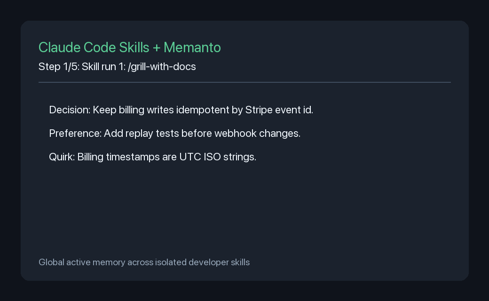

# Claude Code Skills + Memanto Memory Bridge

This example shows how Memanto can act as a global memory companion across separate developer skill executions.

The bridge has two lifecycle hooks:

- `before_skill(...)`: recall relevant engineering memory and return a concise context block that can be appended to a skill prompt.
- `after_skill(...)`: extract durable project decisions, coding preferences, and codebase quirks from a completed skill transcript, then store them in Memanto.



## Why This Matters

Developer skills are intentionally small and focused. That is useful, but it means a decision captured during a review skill can disappear before a later testing or implementation skill starts.

This example keeps those decisions outside the individual skill run:

1. `/grill-with-docs` reviews an architecture plan and records durable decisions.
2. A fresh `/tdd` run asks for tests in the same project.
3. Memanto recalls the earlier decisions and injects them as a compact engineering-memory block.

## Files

```text
examples/claudecode-skills-memanto/
|-- README.md
|-- assets/demo.gif
|-- make_demo_gif.py
|-- memory_backends.py
|-- requirements.txt
|-- run_cross_skill_demo.py
`-- skill_memory_bridge.py
```

## Quick Start

```bash
cd examples/claudecode-skills-memanto
python -m venv .venv
source .venv/bin/activate
pip install -r requirements.txt

# Runs without external keys by using the local JSON backend.
python run_cross_skill_demo.py --backend file --reset
```

## Run With Memanto

Install and configure Memanto first:

```bash
pip install memanto
memanto
```

Then run the same bridge against the real Memanto CLI backend:

```bash
python run_cross_skill_demo.py --backend memanto --agent-id claudecode-skills-demo
```

## Integration Pattern

Wrap skill execution with the bridge:

```python
bridge = SkillMemoryBridge(memory_backend)

memory_context = bridge.before_skill(
    skill_name="/tdd",
    task="Add tests for invoice webhook idempotency",
    file_paths=["apps/billing/webhooks/stripe.ts"],
)

skill_prompt = f"{memory_context}\n\n{original_skill_prompt}"

result = run_skill(skill_prompt)

bridge.after_skill(
    skill_name="/tdd",
    transcript=result.transcript,
    file_paths=result.files_touched,
)
```

The bridge deliberately stores only durable engineering facts:

- `Decision: Keep Stripe webhook handlers idempotent by event id.`
- `Preference: Tests should cover replayed webhook payloads.`
- `Quirk: Billing code stores timestamps as UTC ISO strings.`

It avoids saving full prompts, private credentials, or large transient logs.

## Verification

Regenerate the GIF:

```bash
python make_demo_gif.py
```

Run the demo:

```bash
python run_cross_skill_demo.py --backend file --reset
```

Expected output includes:

```text
MEMANTO ENGINEERING MEMORY
- Decision: Keep billing writes idempotent by Stripe event id.
- Preference: Add replay tests before changing webhook behavior.
- Quirk: Billing timestamps are stored as UTC ISO strings.
```

