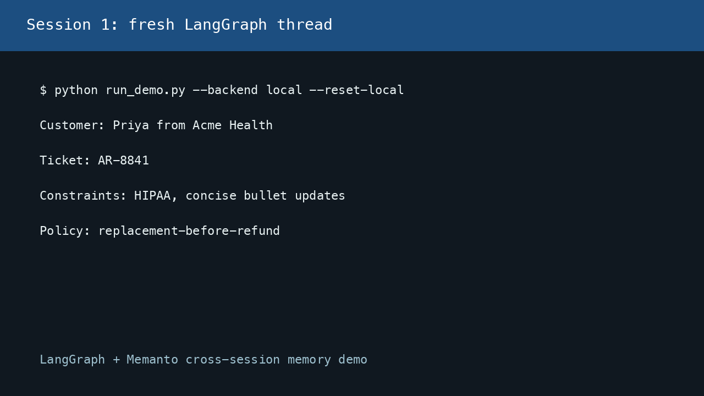

# LangGraph + Memanto Cross-Session Memory

This example shows a LangGraph customer-support workflow using Memanto as the long-term memory layer outside LangGraph's per-thread state. Session 1 stores durable customer facts. Session 2 starts as a new graph invocation with a different thread id and recalls those facts from memory.



## What It Proves

- Cross-session recall: the second turn remembers order `PR-1842`, the customer's replacement preference, and the May 28 launch deadline.
- Memory outside graph state: the graph is compiled without a checkpointer, so only the memory backend can carry information between invocations.
- Review without secrets: the local JSON backend runs the same graph shape without a Moorcheh API key.
- Live Memanto path: switch `--backend memanto` to use `memanto.cli.client.sdk_client.SdkClient`.

## Architecture


## Setup

```bash
python -m venv .venv
source .venv/bin/activate
pip install -r requirements.txt
```

For live Memanto:

```bash
cp .env.example .env
# Edit .env and set MOORCHEH_API_KEY
```

## Run The Credential-Free Demo

```bash
python run_demo.py --backend local --mode full --reset-local
```

Expected session 2 output includes recalled context similar to:

```text
I can continue from durable Memanto memory, even though this is a new LangGraph session.
I found: customer-priya is asking about order PR-1842.
customer-priya prefers replacement before refund.
customer-priya has a launch deadline on May 28.
```

## Run Against Memanto

```bash
python run_demo.py --backend memanto --mode session1
python run_demo.py --backend memanto --mode session2
```

These two commands can be run in separate terminals or on separate days. The second run uses a fresh LangGraph thread id and retrieves memories through Memanto.

## Validate Offline

```bash
python validate_offline.py
```

The validator re-opens the local memory store between session 1 and session 2, asserts that the second graph invocation recalls at least three memories, and checks for the order id, resolution preference, and deadline in the final response.

## File Map

```text
examples/langgraph-memanto/
├── README.md
├── demo.gif
├── requirements.txt
├── .env.example
├── memory_backend.py      # Local JSON backend + live SdkClient backend
├── support_graph.py       # LangGraph StateGraph nodes
├── run_demo.py            # Session 1/session 2/full demo runner
└── validate_offline.py    # Credential-free verification
```

