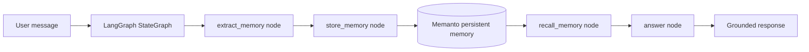

# LangGraph + Memanto: Durable Agent Memory

A working LangGraph example that uses **Memanto** as long-term memory. The graph extracts explicit user memories, stores them in Memanto, and recalls them from a fresh LangGraph run using the same Memanto agent ID.

This demonstrates the difference between short-lived graph state and durable memory: LangGraph orchestrates the workflow, while Memanto persists facts, preferences, context, and instructions beyond a single run.

## 30-second demo


The GIF shows the learn/recall flow: a user teaches the agent preferences and project context, LangGraph extracts typed memories, Memanto stores them outside graph state, and a fresh graph run recalls them.

## What this example shows

- **LangGraph orchestration**: nodes for extraction, storage, recall, and response composition.
- **Memanto long-term memory**: stored memories are tied to a Memanto agent namespace, not an in-process graph object.
- **Cross-run persistence**: run `learn`, stop the process, then run `recall` later with the same agent ID.
- **Typed memories**: stores `fact`, `preference`, `context`, and `instruction` examples with tags and confidence.
- **Testable design**: includes a mock in-memory adapter so graph behavior can be tested without external API calls.

## Architecture



The demo compiles a new graph object for the recall phase and does **not** use a LangGraph checkpointer. In real mode, recalled information comes from Memanto.

## Setup

```bash
git clone https://github.com/moorcheh-ai/memanto.git
cd memanto/examples/langgraph-memanto

python -m venv venv
source venv/bin/activate  # Windows: venv\Scripts\activate
pip install -r requirements.txt

cp .env.example .env
# Edit .env and set MOORCHEH_API_KEY
```

## Quick start with real Memanto

Run the full proof in one command:

```bash
python run_demo.py
```

Or prove cross-process persistence step by step:

```bash
# Process 1: store memories in Memanto
python run_demo.py --phase learn --agent-id langgraph-memanto-demo

# Process 2: create a fresh graph and recall from Memanto
python run_demo.py --phase recall --agent-id langgraph-memanto-demo
```

Expected recall output includes memories like:

```text
I found these persisted memories in Memanto:
- [preference] User preference (...): demo-user prefers concise bullet points.
- [context] User project (...): demo-user's current project is a LangGraph customer support bot.
```

## Run without an API key

Use mock mode to verify the graph and tests without calling the Moorcheh API:

```bash
python run_demo.py --mock
python -m pytest test_langgraph_memory.py
```

Mock mode is intentionally not a replacement for Memanto. It only exercises the same graph interface locally; real persistence uses `MemantoMemoryStore` in `memory_store.py`.

## Files

```text
examples/langgraph-memanto/
├── README.md                 # This guide
├── .env.example              # Moorcheh/Memanto environment template
├── demo.gif                  # 30-second demo GIF
├── graph.py                  # LangGraph StateGraph and memory extraction nodes
├── memory_store.py           # Memanto adapter + test/mock adapter
├── requirements.txt          # Example dependencies
├── run_demo.py               # Learn/recall demo runner
└── test_langgraph_memory.py  # Focused graph tests
```

## Customizing the graph

The extraction node is deterministic on purpose so the example does not require a second LLM key. In production, replace `extract_memories_from_message()` with an LLM-based classifier and keep the `store_memory` and `recall_memory` nodes unchanged.

Useful extension points:

- Add more memory extraction patterns or LLM classification.
- Call `SdkClient.answer()` after recall for a Memanto RAG answer.
- Use a separate `MEMANTO_LANGGRAPH_AGENT_ID` per app, customer, or environment.
- Add LangGraph conditional edges for write-only vs recall-only flows.
