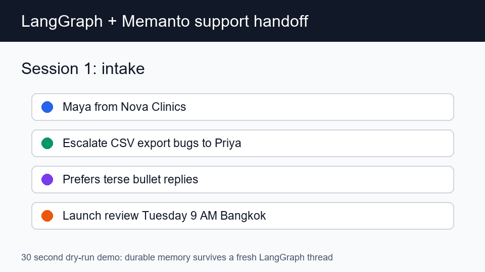

# LangGraph + Memanto: Cross-Session Support Handoff

This example shows a LangGraph support workflow that keeps the current turn in
LangGraph state and stores durable customer context in Memanto. A second,
fresh LangGraph thread can recall the earlier customer's escalation rule,
communication preference, and launch deadline without receiving them in the new
prompt.



## What It Demonstrates

- `StateGraph` orchestration for recall, grounded memory answer, extraction,
  durable write, and reply nodes.
- Memanto SDK usage through `remember`, `recall`, and `answer`.
- Cross-session recall: session 2 starts with a new `thread_id` and no copied state.
- Typed memories using Memanto's `relationship`, `instruction`, `preference`, and
  `commitment` categories.
- A local JSON adapter so reviewers can run the full flow without API keys, plus
  a real Memanto adapter for live use.

## Setup

Run from the repository root:

```bash
python -m pip install -e .
python -m pip install -r examples/langgraph-memanto/requirements.txt
```

For the live Memanto SDK path:

```bash
cp examples/langgraph-memanto/.env.example examples/langgraph-memanto/.env
# Edit .env and set MOORCHEH_API_KEY.
```

## Run The Demo

Offline smoke test:

```bash
cd examples/langgraph-memanto
python run_demo.py --backend local --reset-local
```

Live Memanto SDK run:

```bash
cd examples/langgraph-memanto
python run_demo.py --backend memanto
```

Expected proof point in the second session:

```text
SESSION 2: new LangGraph thread
Memanto recalled durable context from an earlier session:
- instruction: Please always escalate CSV export bugs to Priya.
- preference: I prefer terse bullet replies.
- commitment: The launch review is Tuesday at 9 AM Bangkok time.

Memanto answer: Durable memory says: Please always escalate CSV export bugs to Priya.; I prefer terse bullet replies.; The launch review is Tuesday at 9 AM Bangkok time.
```

The second prompt does not mention Priya, terse replies, or Tuesday. Those facts
come from the long-term memory adapter.

## Architecture

```text
fresh user turn
      |
      v
LangGraph recall_memory node ---> Memanto recall(query)
      |
      v
LangGraph ask_memory node -----> Memanto answer(query)
      |
      v
LangGraph extract_memory node ---> typed memory candidates
      |
      v
LangGraph store_memory node ----> Memanto remember(...)
      |
      v
LangGraph draft_answer node ----> support handoff answer
```

LangGraph owns the short-lived flow state. Memanto owns the durable memory that
survives across independent graph threads.

## Files

```text
examples/langgraph-memanto/
|-- README.md
|-- .env.example
|-- requirements.txt
|-- langgraph_memanto.py
|-- run_demo.py
|-- assets/langgraph-memanto-flight-demo.gif
`-- tests/test_langgraph_memanto.py
```

## Test

```bash
python -m pytest examples/langgraph-memanto/tests -q
python -m ruff check examples/langgraph-memanto
```
