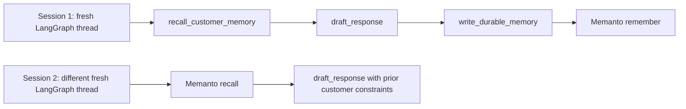

# LangGraph + Memanto: Cross-Session Customer Memory

This example shows Memanto acting as the long-term memory layer for a LangGraph
customer-success agent. LangGraph state stays local to each graph run. Memanto
stores durable, typed memories that a fresh graph can recall later through
LangGraph's native `store=` injection point.


## What This Demonstrates

- Cross-session recall: session two starts with a fresh compiled LangGraph graph
  and still recalls session-one customer facts.
- LangGraph-native integration: graph nodes receive a `BaseStore` through
  `graph.compile(store=store)`.
- Memanto-backed semantic memory: `MemantoLangGraphStore` maps LangGraph
  namespaces and keys onto Memanto `remember` and `recall` calls.
- No-secret validation: `LocalJsonMemantoStore` has the same LangGraph store
  interface, so reviewers can test the flow without a Moorcheh API key.

## Files

```text
examples/langgraph-memanto/
├── README.md
├── .env.example
├── .gitignore
├── demo.gif
├── memanto_langgraph.py
├── requirements.txt
├── run_demo.py
└── validate_offline.py
```

## Setup

```bash
cd examples/langgraph-memanto
python -m venv .venv
source .venv/bin/activate
pip install -r requirements.txt
```

## Run Without Secrets

```bash
python run_demo.py --backend local --reset-local
python validate_offline.py
```

Expected validation output:

```text
offline validation passed
```

The local path writes a small `.local_memories.json` file, then opens a new store
object and compiles a new graph for session two. This proves the remembered
facts are not carried in the first graph's in-memory state.

## Run With Live Memanto

```bash
cp .env.example .env
# edit .env and set MOORCHEH_API_KEY
python run_demo.py --backend memanto
```

The live backend creates or reuses a Memanto agent named
`langgraph-memanto-customer-success`, activates a session, and uses the real
Memanto SDK client for durable storage and semantic recall.

## Architecture



`MemantoLangGraphStore` implements the core `BaseStore` operations:

- `put(namespace, key, value)`: stores a concise LangGraph memory item as a
  typed Memanto memory with namespace and key tags.
- `search(namespace_prefix, query=...)`: uses Memanto semantic recall and then
  applies LangGraph namespace/filter semantics.
- `get(namespace, key)`: performs exact key lookup using deterministic tags.

The demo intentionally uses deterministic response generation rather than an
external LLM. That keeps the integration focused on memory behavior and makes
CI/reviewer validation reproducible.
