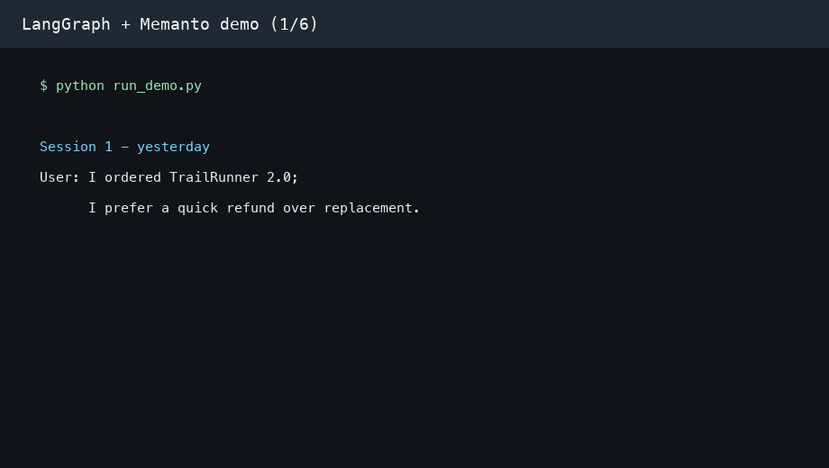

# 🧠 LangGraph + Memanto: Permanent Brain for Your Agents

> Give your LangGraph agents a persistent, cross-session memory that survives restarts, new threads, and even complete application redeployments.

## What This Example Demonstrates

This example builds a **Customer Support Agent** using LangGraph that uses Memanto as its long-term memory layer. The agent can:

- **Remember** customer preferences, past issues, and resolutions across sessions
- **Recall** relevant context from previous conversations when a customer returns
- **Answer** questions using accumulated knowledge, even in brand-new threads

### The Cross-Session Recall Test

