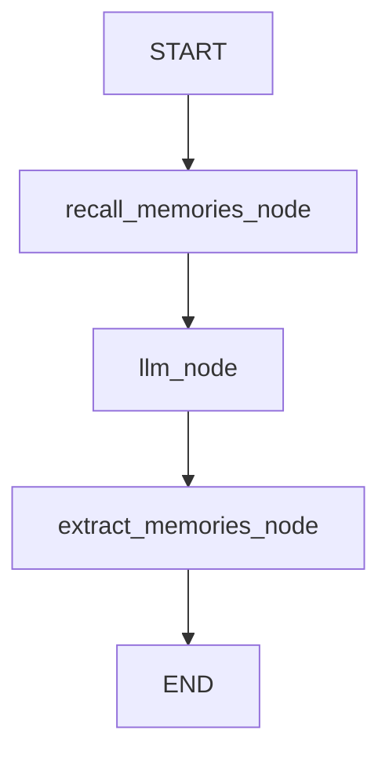

# LangGraph + Memanto Integration Example

This directory contains a complete, working example of integrating **Memanto** as the long-term, session-agnostic memory layer for a stateful **LangGraph** agent.

It demonstrates how to bypass the limitations of thread-scoped agent memory by storing high-level developer preferences and facts in Memanto, which persist across disjointed agent sessions and different execution runs.

## Architecture

The workflow is constructed as a LangGraph `StateGraph` consisting of three distinct nodes:



1. **`recall_memories_node` (Dynamic Injection)**: At the start of a session, the node queries Memanto using the user's latest query to fetch relevant semantic memories. These are injected into the agent's system prompt instructions.
2. **`llm_node` (Reasoning)**: The core agent reasoning step that processes the user query and generates the assistant response based on the message history and any injected long-term memory context.
3. **`extract_memories_node` (Active Extraction)**: Analyzes the conversation interaction at the end of the step. If the user declared any new facts or preferences (e.g. name, programming language choice), it extracts them and saves them permanently in Memanto.

## What This Demonstrates

- **Cross-Session Recall**: The agent recalls context from previous disjointed conversation runs that are completely outside the current thread's memory state.
- **Stateful Heuristic Extraction**: Automatically extracts named facts and preferences from the dialogue flow to maintain an updated user profile in the persistent memory layer.
- **Decoupled Memory**: Memory is stored at the user/global level, allowing multiple different graphs or agents to share the same persistent memory context.

## Setup

1. **Create Virtual Environment**:
   ```bash
   python -m venv venv
   source venv/bin/activate  # Windows: venv\Scripts\activate
   ```

2. **Install Dependencies**:
   ```bash
   pip install -r requirements.txt
   ```

3. **Configure Environment**:
   Set your Moorcheh API key as an environment variable:
   ```bash
   export MOORCHEH_API_KEY="your-api-key"
   ```

## Running the Simulator

To run the interactive simulator demonstrating the cross-session recall of preferences:

```bash
python run_agent.py
```

This simulates two sessions:
- **Session 1**: Alex onboarding and stating a preference for Python and LangGraph.
- **Session 2**: A brand new session (simulating tomorrow) where Alex asks what tools to use, and the agent recalls the preference stored in Session 1 to provide a personalized response.

## Running Tests

To run the unit test suite verifying the memory graph execution flow using mocked SDK client interactions:

```bash
pytest test_langgraph.py
```
