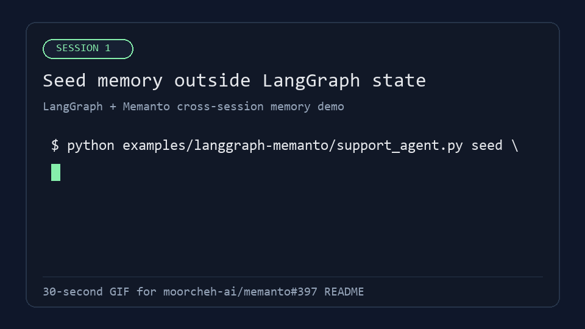

# LangGraph + Memanto Cross-Session Memory

This example demonstrates Memanto as a long-term memory layer for a LangGraph
customer-support workflow. The graph state only contains the current message,
but the agent can still recall a customer preference saved by a previous run.

## What it proves

- **Cross-session recall:** a fact seeded in one process is retrieved by a later
  process that starts with a fresh LangGraph state.
- **State separation:** the recalled memory lives outside the LangGraph state.
- **Practical workflow:** the agent uses the recalled memory to adapt its
  response and writes a new learning after the run.
- **Reviewer-friendly demo:** `--backend file` runs locally without credentials;
  `--backend memanto` uses the real Memanto CLI and Moorcheh-backed storage.

## Files

```text
examples/langgraph-memanto/
├── assets/
│   └── cross-session-demo.gif
├── README.md
├── requirements.txt
└── support_agent.py
```

## 30-second demo



## Install

```bash
pip install -e .
pip install -r examples/langgraph-memanto/requirements.txt
```

For real Memanto storage, configure `MOORCHEH_API_KEY` and create or activate an
agent:

```bash
memanto agent create langgraph-support-demo --pattern project
```

## Local no-credential demo

Seed a memory in one session:

```bash
python examples/langgraph-memanto/support_agent.py seed \
  --backend file \
  --customer-id acme \
  --fact "ACME prefers invoice exports as CSV files." \
  --memory-path .langgraph-memanto-demo.jsonl
```

Start a fresh session with no remembered preference in graph state:

```bash
python examples/langgraph-memanto/support_agent.py ask \
  --backend file \
  --customer-id acme \
  --message "How should I export this month's invoices?" \
  --memory-path .langgraph-memanto-demo.jsonl
```

Expected output includes a response that uses the previously saved CSV
preference even though the current graph state only provided the new question.

## Real Memanto demo

```bash
python examples/langgraph-memanto/support_agent.py seed \
  --backend memanto \
  --agent-id langgraph-support-demo \
  --customer-id acme \
  --fact "ACME prefers invoice exports as CSV files."

python examples/langgraph-memanto/support_agent.py ask \
  --backend memanto \
  --agent-id langgraph-support-demo \
  --customer-id acme \
  --message "How should I export this month's invoices?"
```

## Public showcase

Public demo page: https://memanto-langgraph-memory-showcase.netlify.app/

## Validation

```bash
python -m py_compile examples/langgraph-memanto/support_agent.py tests/test_langgraph_memanto_example.py
pytest tests/test_langgraph_memanto_example.py -q
```
