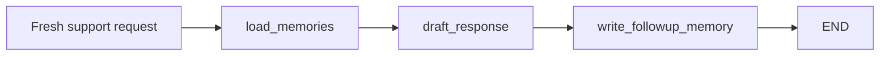

# LangGraph + Memanto: Cross-Session Support Memory

This example shows a LangGraph support workflow using Memanto as durable long-term memory outside the graph state. A fresh day-two graph run recalls facts, preferences, and instructions stored by a previous day-one session.

## What It Demonstrates

- Cross-session recall: the second run starts with empty LangGraph state but recalls prior customer memory.
- Memanto as the durable layer: LangGraph orchestrates nodes; Memanto stores and retrieves long-term memory.
- Reviewable offline path: `LocalMemoryAdapter` validates behavior with JSON storage and no API keys.
- Production path: `MemantoSdkAdapter` uses `memanto.cli.client.sdk_client.SdkClient` when `MOORCHEH_API_KEY` is set.

## Files

```text
examples/langgraph-memanto/
├── README.md
├── langgraph_memanto.py
├── run_demo.py
├── validate_offline.py
└── requirements.txt
```

## Quick Start

```bash
cd examples/langgraph-memanto
python -m venv .venv
source .venv/bin/activate
pip install -r requirements.txt
python validate_offline.py
python run_demo.py --backend local --reset-local
```

Expected validation:

```text
offline validation passed
```

Expected demo behavior:

- Day one seeds durable memories for customer `CUST-042`.
- Day two invokes a new LangGraph thread with no prior graph state.
- The `load_memories` node recalls customer tone, order `AR-8841`, and the replacement-before-refund rule from the durable memory layer.
- The `write_followup_memory` node stores the latest support request as a new event memory.

## Live Memanto Backend

```bash
export MOORCHEH_API_KEY="your-key"
python run_demo.py --backend memanto
```

The live backend creates or reuses the `langgraph-memanto-support` Memanto agent, activates a session, writes day-one memories, and recalls them in the day-two graph run.

## Graph Flow



## Demo GIF


## Why This Pattern

LangGraph state is useful for one execution thread, but support teams often need memory that survives across unrelated tickets, browser sessions, or agent restarts. This example keeps ephemeral orchestration in LangGraph and puts durable customer facts, preferences, instructions, and events into Memanto.
