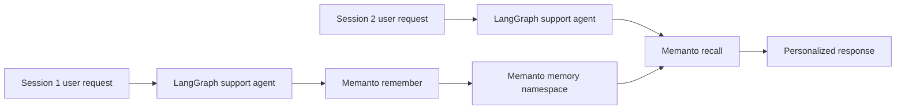

# LangGraph + Memanto Cross-Session Memory

This example shows Memanto acting as the long-term memory layer for a
LangGraph support agent. The graph keeps short-lived state in LangGraph and
stores durable preferences, facts, and events in Memanto so a later session can
recall what happened before.

## What It Demonstrates

- Cross-session recall: session 2 remembers the user's plan and preferences
  from session 1 without passing them through LangGraph state.
- Clean separation of state: LangGraph carries the current turn, while Memanto
  stores long-lived memories.
- Production-shaped adapter: the demo includes an HTTP adapter for a local
  Memanto server and a fake adapter for quick offline runs.
- Typed memories: preferences and facts are stored with explicit memory types.

## Architecture



## Files

```text
examples/langgraph-memanto/
├── README.md
├── requirements.txt
├── memory_adapter.py
├── support_graph.py
├── run_session_one.py
└── run_session_two.py
```

## Quick Offline Demo

The offline mode uses an in-memory JSON file to prove the workflow shape
without requiring API keys.

```bash
cd examples/langgraph-memanto
python -m venv .venv
.venv\Scripts\activate  # Windows
pip install -r requirements.txt
python run_session_one.py --offline
python run_session_two.py --offline
```

Expected behavior:

1. Session 1 stores that Sam prefers concise replies and is migrating billing
   alerts by Friday.
2. Session 2 starts with a fresh LangGraph state.
3. The graph recalls those Memanto memories and answers with the remembered
   deadline and communication preference.

## Real Memanto Demo

Start Memanto locally and export the session token from an activated agent:

```bash
memanto serve
memanto agent create langgraph-support
memanto agent activate langgraph-support
```

Then run:

```bash
export MEMANTO_BASE_URL=http://127.0.0.1:8000
export MEMANTO_AGENT_ID=langgraph-support
export MEMANTO_SESSION_TOKEN=your-session-token
python run_session_one.py
python run_session_two.py
```

## Demo Video


Record the two commands above with any terminal recorder. A 30-second clip can
show:

1. `run_session_one.py` storing memories.
2. `run_session_two.py` starting a new graph state.
3. The answer recalling the user's deadline and concise-response preference.

PR demo link: add the recording URL in the pull request description after
uploading it to X, LinkedIn, Reddit, or a video host.
