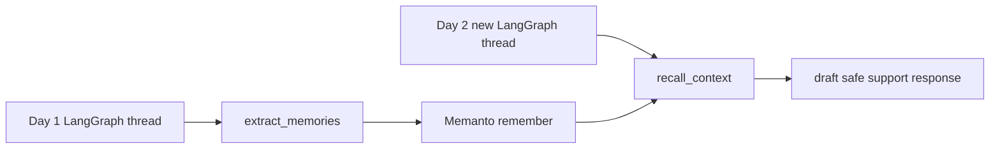

# LangGraph + Memanto: Cross-Session Support Memory

This example shows a LangGraph customer-support workflow using Memanto as durable long-term memory. The first run stores customer preferences and safety rules. The second run starts a brand-new LangGraph thread with no in-graph state and still recalls yesterday's context from Memanto.

## Demo

[30-second demo GIF](./demo.gif)

The demo shows:

- Day 1 stores Priya's clinic identity, SMS preference, vendor name, and PHI approval rule.
- Day 2 starts a different LangGraph `thread_id`.
- The agent recalls yesterday's memories and drafts a safe response without relying on checkpoint state.

## Why Memanto

LangGraph is excellent for stateful workflows inside a thread. Memanto adds the missing durable memory layer across disjointed sessions, workers, and restarts. In this example, LangGraph carries the current turn state while Memanto stores memory records that future threads can retrieve semantically.

## Files

```text
examples/langgraph-memanto/
├── README.md
├── demo.gif
├── memory_backends.py
├── requirements.txt
├── run_demo.py
├── support_agent.py
└── validate_offline.py
```

## Quick Start

```bash
cd examples/langgraph-memanto
python -m venv .venv
# macOS / Linux
source .venv/bin/activate
# Windows (PowerShell)
# .venv\Scripts\Activate.ps1
pip install -r requirements.txt
python run_demo.py --backend local --reset-local
```

Expected ending:

```text
=== Day 2: fresh LangGraph thread recalls yesterday ===
Thread: thread-day-2
Recalled: 4 memories

Agent response:
Hi Priya from Northstar Dental, I can help with that. I will use SMS ...

Cross-session recall verified.
```

## Live Memanto Backend

Use the live backend when you have a Moorcheh API key:

```bash
# macOS / Linux
export MOORCHEH_API_KEY=your-key
# Windows (PowerShell)
# $env:MOORCHEH_API_KEY="your-key"
python run_demo.py --backend memanto --agent-id langgraph-support-demo
```

The live backend creates or reuses a Memanto agent, activates a session, stores memories with `SdkClient.remember`, and recalls them with `SdkClient.recall`.

## Offline Validation

Reviewers can validate the behavior without secrets:

```bash
python validate_offline.py
```

The offline backend is intentionally deterministic and local, but it uses the same graph nodes and backend contract as the Memanto SDK backend. That keeps the review path easy while preserving the production integration point.

## Architecture



## Bounty Criteria

- Cross-session recall: day two uses a new `thread_id` and recalls day-one memory.
- Clean single folder: all example code lives in `examples/langgraph-memanto`.
- Documented code: README plus small, typed modules.
- Demo link: `demo.gif` is included in this folder.

