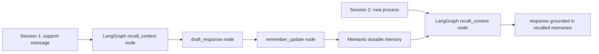

# LangGraph + Memanto Cross-Session Memory

This example shows a LangGraph support agent using Memanto as durable memory outside LangGraph's thread state. One run stores customer context, then a later run builds a brand-new graph process and recalls that context from Memanto.

Demo GIF: [LangGraph + Memanto cross-session recall](assets/langgraph-memanto-demo.gif)

## What it demonstrates

- A `StateGraph` with explicit recall, intent, response, and memory-write nodes.
- Cross-session recall: session two answers from memory written by session one.
- A credential-free preview store so reviewers can run the flow immediately.
- A live Memanto mode using `MOORCHEH_API_KEY` and the same graph code.

## Architecture



## Setup

```bash
cd examples/langgraph-memanto
python -m venv .venv
source .venv/bin/activate
pip install -r requirements.txt
```

## Run without secrets

Preview mode writes to `.memanto-preview/memories.jsonl`, which is ignored by git.

```bash
python run_demo.py --mode full --reset
```

The `full` run intentionally rebuilds the store and graph between "yesterday" and "today" so the second response cannot rely on in-process LangGraph state.

## Run against live Memanto

```bash
cp .env.example .env
# Fill MOORCHEH_API_KEY in .env
python run_demo.py --mode seed --live
python run_demo.py --mode recall --live
```

Both commands use the same `MEMANTO_LANGGRAPH_AGENT_ID`, proving that Memanto is the memory layer across separate sessions.

## Files

```text
examples/langgraph-memanto/
├── README.md
├── requirements.txt
├── .env.example
├── graph.py              # LangGraph StateGraph nodes and edges
├── memory_store.py       # Live Memanto adapter + local preview adapter
├── run_demo.py           # seed, recall, and full cross-session demo
├── state.py              # Typed graph state and memory payloads
└── assets/
    └── langgraph-memanto-demo.gif
```
