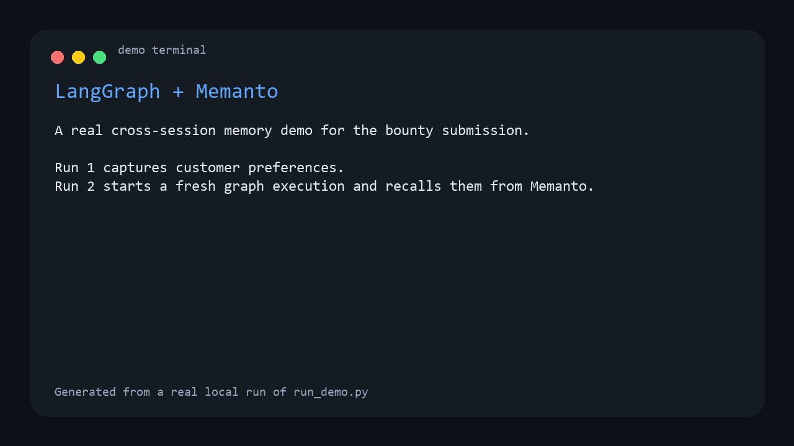

# LangGraph + Memanto Example

This example answers the bounty brief in [moorcheh-ai/memanto#397](https://github.com/moorcheh-ai/memanto/issues/397): it builds a real `LangGraph` workflow that uses `Memanto` as a long-term memory layer outside normal graph state.

## What This Demonstrates

- Cross-session recall: a customer shares preferences on day 1, then the graph recalls them on day 2 in a fresh run
- LangGraph orchestration: the flow is a real graph, not a linear script
- Practical agent memory: the example feels like a support assistant that remembers names, delivery preferences, and product settings
- Low-friction demo path: if you do not provide an LLM key, the graph still runs with a deterministic fallback so the memory behavior is visible

## Architecture

The graph has three nodes:

1. `retrieve_context`
2. `draft_reply`
3. `persist_memories`

`Memanto` is only used for long-term memory. The graph state stays small and session-local.

## Prerequisites

- Python 3.10+
- A [Moorcheh API key](https://console.moorcheh.ai/api-keys)
- Optional: an OpenAI-compatible API key for nicer replies

## Setup

```bash
python -m venv venv
source venv/bin/activate  # Windows: venv\Scripts\activate
pip install -r requirements.txt
cp .env.example .env
```

Edit `.env` and set:

- `MOORCHEH_API_KEY`
- Optional: `OPENAI_API_KEY`
- Optional: `OPENAI_BASE_URL`
- Optional: `LANGGRAPH_DEMO_MODEL`

## Run The Demo

Recommended two-step proof:

```bash
# Day 1: customer shares new preferences
python run_support_session.py \
  --session-label day-1 \
  --customer-id maya-007 \
  --message "Hi, I'm Maya. Call me MJ. I prefer dark mode and weekly email digests."

# Day 2: new run, new session, but the graph still remembers
python run_support_session.py \
  --session-label day-2 \
  --customer-id maya-007 \
  --message "What do you remember about how I like updates and settings?"
```

Or run the bundled sequence:

```bash
python run_demo.py
```

`run_demo.py` creates a fresh agent id by default so the day-1 proof starts from a clean memory baseline. Set `LANGGRAPH_DEMO_AGENT_ID` if you want to reuse the same agent across separate runs.

## Demo Preview



This GIF is generated from a real local run of the demo and shows the proof shape reviewers care about:

- Run 1 stores preferences in Memanto
- Run 2 recalls them in a separate graph execution
- The graph answers using long-term memory rather than only current state

## File Structure

```text
examples/langgraph-memanto/
├── README.md
├── .env.example
├── requirements.txt
├── memory_client.py
├── graph.py
├── run_support_session.py
├── run_demo.py
└── langgraph-memanto-demo.gif
```

## Notes For Reviewers

- `memory_client.py` uses Memanto's direct Python client so the demo can create, activate, write, and recall without a flaky shell hop
- `graph.py` builds a real `StateGraph`
- The example intentionally keeps memory outside graph state, which is the point of the challenge
- If an OpenAI-compatible model is configured, the graph uses it for reply generation; otherwise it falls back to deterministic reply assembly so cross-session recall is still easy to verify
