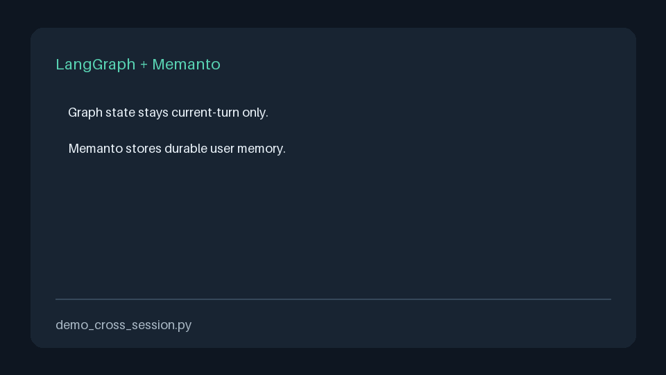

# LangGraph + Memanto Travel Concierge

This example shows a LangGraph workflow using Memanto as long-term memory
outside the graph state. The "yesterday" run stores travel preferences. The
"today" run starts with a fresh LangGraph state and still recalls those
preferences through the memory layer.



## What It Demonstrates

- Cross-session recall: today's graph state does not include yesterday's facts.
- External memory boundary: LangGraph nodes depend on a `MemoryStore` protocol.
- Memanto path: `MemantoMemoryStore` uses `memanto.cli.client.sdk_client.SdkClient`.
- Offline review path: `LocalJsonMemoryStore` lets reviewers run the same graph
  without API keys.
- Typed memories: meal preference, seat preference, destination goal, and travel
  timing are stored as atomic memories.

## Files

```text
examples/langgraph-memanto/
├── README.md
├── .env.example
├── requirements.txt
├── travel_concierge.py
├── assets/cross-session-recall.gif
└── tests/test_travel_concierge.py
```

## Quick Start: Offline Demo

```bash
cd memanto
python -m venv .venv-langgraph
source .venv-langgraph/bin/activate
pip install -e .
pip install -r examples/langgraph-memanto/requirements.txt

python examples/langgraph-memanto/travel_concierge.py \
  --backend local \
  --reset-local \
  --session full
```

Expected shape:

```text
=== YESTERDAY SESSION ===
I do not have long-term travel memories yet...
Stored: local-1, local-2, local-3, local-4

=== TODAY SESSION ===
I recalled these long-term memories before responding:
- The traveler prefers vegetarian meal options.
- The traveler prefers aisle seats when flying.
- The traveler is planning a trip to Lisbon.
- The traveler mentioned a departure next Tuesday.
```

## Run With Memanto

```bash
cd memanto
cp examples/langgraph-memanto/.env.example examples/langgraph-memanto/.env
set -a
source examples/langgraph-memanto/.env
set +a

pip install -e .
pip install -r examples/langgraph-memanto/requirements.txt

python examples/langgraph-memanto/travel_concierge.py \
  --backend memanto \
  --agent-id langgraph-travel-concierge \
  --session full
```

The graph is identical in both modes. Only the memory store changes.

## Why This Pattern

LangGraph is excellent at managing per-run state and control flow. Memanto is a
better fit for durable, queryable memory that should survive graph runs. This
example keeps the boundary explicit:

1. `recall_memories` queries Memanto before the agent drafts a response.
2. `draft_response` uses the recalled memories, not hidden global state.
3. `persist_new_memories` stores any new durable facts after the response.

That gives the agent continuity without stuffing old conversations into every
LangGraph state payload.

## Tests

```bash
pytest examples/langgraph-memanto/tests -q
python -m py_compile examples/langgraph-memanto/travel_concierge.py
```

## Bounty Notes

This PR targets the Memanto + LangGraph BountyHub challenge in issue #397.

- Repo starred with the submitting GitHub account.
- Code is contained in `examples/langgraph-memanto`.
- The README includes a demo GIF.
- Social post link: pending from the account owner, because external social
  publishing is intentionally kept outside this code contribution.
