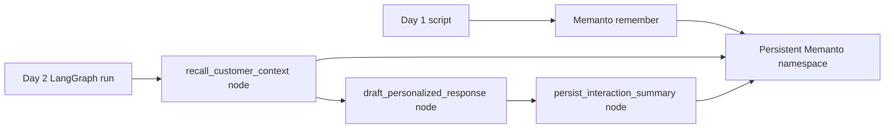

# LangGraph + Memanto: Cross-Session Agent Memory

This example shows a LangGraph support agent using **Memanto** as its long-term
memory layer. The graph runs in two separate sessions:

1. Day 1 stores customer facts, preferences, and commitments in Memanto.
2. Day 2 starts a fresh LangGraph run, recalls those memories, and answers with
   yesterday's context even though it is not present in the current graph state.


## What This Demonstrates

- **Cross-session recall**: the Day 2 graph retrieves details stored in Day 1.
- **Typed memory**: facts, preferences, commitments, and events are stored with
  Memanto memory types.
- **LangGraph-native flow**: memory recall and memory writeback are explicit graph
  nodes, so the workflow stays inspectable.
- **No external LLM key required**: the example uses deterministic graph nodes so
  developers can focus on the memory integration.

## Architecture



## Prerequisites

- Python 3.10+
- A [Moorcheh API key](https://console.moorcheh.ai/api-keys)

## Setup

```bash
git clone https://github.com/moorcheh-ai/memanto.git
cd memanto/examples/langgraph-memanto

python -m venv .venv
source .venv/bin/activate  # Windows: .venv\Scripts\activate

pip install -r requirements.txt
cp .env.example .env
# Edit .env and set MOORCHEH_API_KEY
```

When running from a source checkout, install the local package first:

```bash
cd ../..
pip install -e .
cd examples/langgraph-memanto
```

## Run The Demo

Run both sessions:

```bash
python run_full_demo.py
```

Or run them separately to make the persistence boundary obvious:

```bash
python run_day1_seed_memory.py
python run_day2_recall.py
```

## Expected Output

Day 1 stores three long-term memories:

```text
Stored Day 1 memories in Memanto:
- mem_...
- mem_...
- mem_...
```

Day 2 starts a new session, retrieves those memories, and then stores a new event:

```text
Recalled memories:
- [fact] customer-aurora timezone: Customer Aurora works in Europe/Amsterdam time.
- [preference] customer-aurora communication preference: Customer Aurora prefers concise answers...
- [commitment] customer-aurora export commitment: Support promised to help Customer Aurora enable nightly CSV exports after 18:00 CET.

Agent response:
I found your saved support context and will keep this concise.
...
Recommended next step: enable the export job after 18:00 CET...
```

## File Structure

```text
examples/langgraph-memanto/
├── README.md
├── .env.example
├── requirements.txt
├── memanto_memory.py          # Memanto SdkClient adapter
├── graph.py                   # LangGraph nodes and edges
├── run_day1_seed_memory.py    # Session 1: store memories
├── run_day2_recall.py         # Session 2: recall memories
└── run_full_demo.py           # Runs both sessions
```

## Why This Pattern Works

LangGraph state is excellent for the current execution, but it is not meant to be
the long-term memory of an agent across unrelated sessions. This example keeps
short-lived state inside LangGraph and stores durable facts, preferences, and
commitments in Memanto. A later graph run can recall the relevant memory without
being handed the previous conversation.
