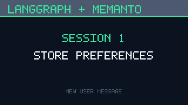
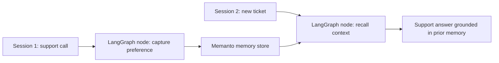

# LangGraph + Memanto: Long-Term Support Memory

This example shows a LangGraph support workflow using Memanto as memory outside the graph state. The first session stores a customer preference. The second session starts with a fresh LangGraph state and answers by recalling that preference from the memory layer.

## Demo

The 30-second GIF below walks through the two-session flow: session 1 stores a
support preference through the Memanto adapter, and session 2 recalls it from a
fresh LangGraph invocation. Open the media directly at
[`assets/langgraph-memanto-demo.gif`](./assets/langgraph-memanto-demo.gif).





## Why This Uses Memanto

LangGraph is good at routing the current turn through a graph. It should not need to carry every durable user fact inside that graph state. In this example, the state passed through LangGraph only contains the current thread id, user id, message, recalled memories for the turn, and response. The long-lived preference is stored behind a `MemoryStore` adapter and can be backed by real Memanto or the local dry-run adapter.

| File | Role |
| --- | --- |
| `support_agent.py` | Defines the LangGraph state, nodes, and compiled workflow. |
| `memory_adapter.py` | Provides a Memanto SDK adapter and a no-key dry-run adapter with the same interface. |
| `run_demo.py` | Runs two separate support sessions to show recall across a fresh graph state. |
| `tests/test_support_agent.py` | Verifies cross-session recall and confirms durable profile memory is not carried in graph state. |

## Local Smoke Test

The dry-run mode does not call external services. It keeps the memory outside LangGraph state, using the same adapter shape as the Memanto SDK path, so reviewers can verify the graph behavior without keys.

```bash
cd examples/langgraph-memanto
python -m venv .venv
.venv\Scripts\activate
pip install -r requirements.txt
python run_demo.py --mode dry-run
```

The local test path uses the same dry-run adapter and LangGraph workflow:

```bash
pytest tests -q
```

Expected transcript:

```text
LangGraph + Memanto cross-session recall
memory_mode=dry-run

Session 1: capture a preference
thread_id=yesterday-onboarding-call
user=customer-dana
recalled_memories=0
stored_memory_id=dry-...
agent_response=Saved that preference outside the graph state.

Session 2: answer from memory
thread_id=today-new-ticket
user=customer-dana
recalled_memories=1
agent_response=I found a stored preference from a previous session: Dana wants invoices emailed every Friday with the purchase order in the subject. I would use that when handling this ticket.
```

## Real Memanto Run

Set a Moorcheh API key and switch the adapter to SDK mode. The example creates or reuses a Memanto agent named `langgraph-memanto-support`, activates a session, stores the first-turn preference, then recalls it in the second turn.

```bash
cd examples/langgraph-memanto
python -m venv .venv
.venv\Scripts\activate
pip install -r requirements.txt
set MOORCHEH_API_KEY=your-key
python run_demo.py --mode memanto
```

On macOS or Linux, use `export MOORCHEH_API_KEY=your-key` instead of `set`.

## What To Look For

| Criterion | Where it appears |
| --- | --- |
| Cross-session recall | `run_demo.py` runs `yesterday-onboarding-call` and `today-new-ticket` with separate graph invocations. |
| Memory outside LangGraph state | `SupportState` has no durable profile field; `memory_store` is captured by the graph nodes. |
| Clean single-folder example | All new example code lives under `examples/langgraph-memanto`. |
| Reviewer-friendly validation | Dry-run mode needs no secrets, and SDK mode is one flag away when `MOORCHEH_API_KEY` is available. |
