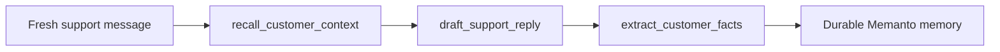

# LangGraph + Memanto Cross-Session Memory

This example shows Memanto acting as the long-term memory layer for a LangGraph customer-support agent.

The important bit: session two starts with fresh LangGraph state, then recalls facts written during session one from durable memory outside the graph.

## What It Demonstrates

- A LangGraph workflow with separate recall, response, and memory-write nodes.
- Cross-session recall for a returning customer.
- A review-friendly local JSON adapter.
- A real Memanto SDK adapter for production usage.

## Run Offline

```bash
cd examples/langgraph-memanto
python -m venv .venv
source .venv/bin/activate
pip install -r requirements.txt
pip install -e ../..
python run_demo.py
```

Expected output includes a day-two response that remembers:

- dark mode preference
- Friday renewal reminders
- SMS follow-ups for urgent billing issues

## Run With Memanto

```bash
export MEMANTO_BACKEND=memanto
export MOORCHEH_API_KEY=your-api-key
python run_demo.py
```

The same graph will use `memanto.cli.client.sdk_client.SdkClient` to create or reuse a Memanto agent namespace, activate a session, store memories, and recall them on the second run.

## Graph Shape



## Demo Video


