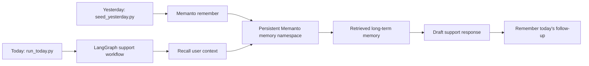

# LangGraph + Memanto: Cross-Session Support Agent

This example shows a LangGraph customer-support agent using Memanto as a persistent long-term memory layer outside the normal LangGraph state.


## What This Demonstrates

- **Cross-session recall**: `seed_yesterday.py` stores memories in one Python process, then `run_today.py` starts a new process with only today's user message in LangGraph state.
- **Memory outside graph state**: LangGraph carries the current request and generated response. Memanto carries long-term customer facts, preferences, and open issues.
- **Typed semantic memories**: The demo stores preferences, facts, events, and decisions with confidence and provenance.
- **No extra LLM key required**: The workflow is deterministic so the memory integration is easy to inspect and record.

## Architecture



## Setup

```bash
cd examples/langgraph-memanto
python -m venv .venv
source .venv/bin/activate  # Windows: .venv\Scripts\activate
pip install -r requirements.txt
cp .env.example .env
# Edit .env and add MOORCHEH_API_KEY
```

If you are working from a local clone of this repository, install Memanto itself in editable mode:

```bash
pip install -e ../..
```

## Run The Cross-Session Demo

First, simulate yesterday's support session and write memories:

```bash
python seed_yesterday.py
```

Then start a new process for today's session:

```bash
python run_today.py
```

You should see the agent answer today's question using facts that are not present in today's LangGraph input state, such as the customer's preferred communication style, timezone, account tier, and previously reported inverter issue.

For a single terminal recording:

```bash
python run_full_demo.py
```

Expected recall signals:

```text
Starting today's LangGraph run with state:
{'user_id': 'maya-rivera', 'user_message': 'Can you remind me what we were working on yesterday and how I prefer updates?'}

Long-term memory recalled by Memanto:
Found 6 memories

- maya-rivera is in the America/Los_Angeles timezone...
- maya-rivera prefers email updates...
- maya-rivera is a Pro-tier customer...
- Support issue INV-4832...
- maya-rivera prefers concise support updates...
- Decision for INV-4832...
```

Those facts are written by `seed_yesterday.py` and recalled by `run_today.py`; they are not passed into LangGraph's initial state.

## Quick Smoke Test

To validate the LangGraph wiring without a Moorcheh key, run the in-memory smoke test:

```bash
python smoke_test.py
```

The smoke test replaces Memanto with a tiny fake memory client so reviewers can confirm the graph recalls context, drafts a response, and writes a follow-up. The real demo scripts above still use the Memanto CLI.

## Why This Proves Persistence

`run_today.py` initializes LangGraph with only:

```python
{
    "user_id": "maya-rivera",
    "user_message": "Can you remind me what we were working on yesterday and how I prefer updates?",
}
```

The graph does not receive yesterday's customer profile, support issue, or communication preference in state. The `recall_user_context` node retrieves those facts from Memanto, and the `remember_today_followup` node writes a new event back to Memanto for future sessions.

## File Structure

```text
examples/langgraph-memanto/
├── README.md             # This guide
├── .env.example          # Environment template
├── requirements.txt      # LangGraph + Memanto dependencies
├── memanto_memory.py     # Small Memanto CLI adapter
├── graph.py              # LangGraph workflow
├── seed_yesterday.py     # Session 1: store long-term memories
├── run_today.py          # Session 2: recall memories in a new graph run
├── run_full_demo.py      # Convenience runner for recordings
├── smoke_test.py         # No-secret graph smoke test
└── demo.gif              # 30-second demo asset
```

## Example Memory Flow

1. Yesterday, the user says they prefer concise email updates, are in Pacific time, and need help with inverter issue `INV-4832`.
2. Memanto stores those as typed memories.
3. Today, the user asks what the agent remembers.
4. LangGraph calls Memanto from a node, receives relevant memories, drafts the reply, and stores today's follow-up.

## Troubleshooting

- `MOORCHEH_API_KEY not set`: copy `.env.example` to `.env` and add your key.
- `memanto command failed`: run `pip install -e ../..` from this folder or `pip install memanto`.
- Duplicate memories after repeated demos: use a different `MEMANTO_AGENT_ID` in `.env` for a fresh namespace.
