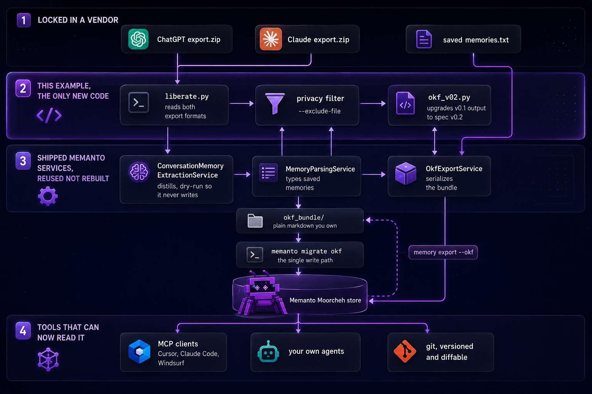

# Liberate your assistant's memory (ChatGPT and Claude to OKF)

Your agent's memory is portable now. The memory your *assistant* built about
you still isn't.

ChatGPT and Claude have both spent months learning your stack, your habits and
your preferences. You can read that memory in a settings pane. You cannot move
it. There is no export button for it, no API, no format, and if you switch
assistants, it is gone.

This example takes an official ChatGPT or Claude data export and turns it into
an **OKF bundle**: plain markdown, on your disk, in a vendor-neutral format
that `memanto migrate okf` imports like any other bundle. In, owned,
portable, for the memory that was previously the hardest to move.

## What this demonstrates

- A **new migration path** for a source Memanto doesn't support: exported
  assistant conversations and saved memories.
- **Distilled memories, not transcript dumps.** A migration that copies your
  old prompts across has moved text, not memory. This distills durable facts,
  preferences and decisions out of conversations.
- A **lossless OKF round trip**: import the bundle, export it again, and the
  type, source, confidence and provenance all survive.
- **No new CLI surface and no core changes.** The diff is this folder.

## Architecture



Band 2 is ours, and it is the entire diff. Band 3 already shipped: the adapter
adds no CLI command and reimplements no import logic, so `migrate okf` remains
the only thing that writes to a store.

`liberate.py` deliberately owns only the part nothing else can do, reading
ChatGPT's node-graph export and Claude's message-list export. Everything else
is a shipped Memanto service, so there is no second implementation to drift:

| Job | Shipped service used | Why it matters |
|---|---|---|
| Distill conversations into memories | `ConversationMemoryExtractionService` (the engine behind `memanto remember --from-conversation`) | Same extraction prompt Memanto already trusts, and it refuses to emit secrets, keys and tokens |
| Type a saved memory | `MemoryParsingService` | The rule-based classifier that runs on every write. No memory type is guessed here |
| Write the bundle | `OkfExportService` | Output is identical in shape to `memanto memory export --okf`, so it round-trips by construction |

Distillation runs the extractor in **dry-run mode**: nothing is written during
extraction. Memories enter Memanto only later, through `migrate okf`, so the
CLI stays the single write path, with its own preview and batching.

## Getting your data

[EXPORTING.md](EXPORTING.md) covers both sources: where to click, what each
archive contains, and what the export quietly leaves out.

## Prerequisites

- Python 3.10+
- A free Moorcheh API key, <https://console.moorcheh.ai>
- Your data export (optional for the quick start):
  - **ChatGPT**, Settings, Data controls, Export data. You get a link by
    email. The zip contains `conversations.json`, or, once your history is
    large enough, `conversations-000.json` and friends. Both are read.
  - **Claude**, Settings, Privacy, Export data. Same shape.
  - **Saved memories**, see the caveat below; these are *not* in either export.

## Setup

```bash
cd examples/migrations/chatgpt-claude-okf
python -m venv .venv && source .venv/bin/activate
pip install -r requirements.txt
cp .env.example .env      # add MOORCHEH_API_KEY
```

## Run it

```bash
bash run.sh my-agent                                  # sample fixtures, ~1 minute
bash run.sh my-agent ~/Downloads/chatgpt-export.zip   # your real ChatGPT history
```

Either assistant works alone, and together they merge into one bundle:

```bash
CLAUDE=~/Downloads/claude-export.zip bash run.sh my-agent          # Claude only
CLAUDE=~/Downloads/claude-export.zip SAVED=my_memories.txt \
  bash run.sh my-agent ~/Downloads/chatgpt-export.zip              # everything
```

| Variable | Default | What it does |
|---|---|---|
| `CLAUDE` | none | Path to a Claude export |
| `SAVED` | none | Path to your pasted saved memories |
| `LIMIT` | `25` | Conversations to process. Each one costs a Gen AI call, start low |
| `FRESH` | `0` | Delete the agent first, so totals are not inflated by earlier runs |

A full sample run, two ChatGPT threads, two Claude threads and five saved
memories, produces 23 memories across 9 types and imports all 23 with zero
failures. Captured output lives in [`evidence/`](evidence/).

That script creates the agent, builds the bundle, previews the import with
`--dry-run`, imports it, then exports it back out as OKF. To use one input at a
time:

```bash
python liberate.py --inspect --chatgpt export.zip              # no API needed
python liberate.py --agent my-agent --chatgpt export.zip --limit 20
python liberate.py --agent my-agent --claude export.zip --out ./okf_bundle
python liberate.py --saved my_memories.txt --out ./okf_bundle   # no API needed
memanto migrate okf ./okf_bundle --dry-run
```

Start with `--inspect`. It reads an export and counts what is actually in it , 
conversations, messages, `bio` tool writes (the moments ChatGPT committed a
memory), replayed memory snapshots and custom instructions, without calling
any API. Export contents vary by account and by when the export was produced,
so measure yours rather than trusting anyone's claim about it, including the
one below.

Re-running is safe: the bundle directory is rebuilt from scratch each time, and
`FRESH=1 bash run.sh <agent>` also resets the agent so totals never
double-count. Both matter because extraction is non-deterministic, the same
conversation can yield differently-titled memories on a second pass.

## OKF v0.2 conformance

Memanto's exporter targets OKF **v0.1**. The specification moved to
[v0.2](https://github.com/GoogleCloudPlatform/knowledge-catalog/blob/main/okf/SPEC.md)
on 24 July 2026. This example emits v0.2 by default and upgrades the bundle
*after* `OkfExportService` has written it, so the structure, slugs, stacking and
index bodies remain Memanto's own. Only frontmatter changes.

| Spec | What v0.1 output does | What this adds |
|---|---|---|
| Section 5.2 trust | `timestamp` only | `generated: { by, at }`, retaining `timestamp` for v0.1 readers |
| Section 5.1 provenance | none | `sources`, pointing back at the conversation or file each memory came from |
| Section 8 index files | frontmatter in every `index.md` | frontmatter only at the bundle root, and only `okf_version` |
| Section 11 rule 1 | `metrics/overview.md` has no frontmatter | given a `type`, so every non-reserved document is conformant |
| Section 12 versioning | never declared | `okf_version: "0.2"` at the bundle root |

The three v0.1 gaps in that table are reported upstream as
[#1889](https://github.com/moorcheh-ai/memanto/issues/1889). They are fixed here
in this example's own output, not in `OkfExportService`, so nothing outside this
folder changes.

Two deliberate choices worth knowing:

`generated.at` reuses the memory's own source date rather than the moment the
bundle was built. That keeps a v0.1 and a v0.2 reader agreeing on the same date,
and it stops re-runs churning committed artifacts. Where the source carries no
date, the key is omitted rather than invented: the spec requires only
`generated.by`.

`status` is not emitted. The spec states that an absent `status` means `stable`,
so writing it would add bytes and no information.

Pass `--okf-version 0.1` to emit exactly what Memanto's exporter produces.

Everything added here is an unknown key to Memanto's importer, which preserves
unknown frontmatter in a `[Supporting data]` footer rather than dropping it. The
round trip is therefore lossless in both directions, and there is a test for it.

## Mapping table

| Source | -> Memanto | -> OKF field |
|---|---|---|
| Conversation turns (user + assistant) | distilled `content` | body |
| Extracted memory title | `title` | `title`, and `description` (first line) |
| Extracted memory type | `type` (one of the 13) | `type`, and `x_memanto.type` |
| Extractor confidence | `confidence` | `x_memanto.confidence` |
| Conversation id | `source_ref` | `resource` |
| Conversation `create_time` / `created_at` | `created_at` | `timestamp` |
| `chatgpt` \| `claude` | `source` | `x_memanto.source` |
| set by the adapter | `provenance: imported` | `x_memanto.provenance` |

Because the type travels in `x_memanto.type`, the importer uses it directly
instead of re-classifying. The round trip is type-stable, not best-effort.

## Caveat: saved memories have no export of their own

**ChatGPT gives you no dedicated export and no API for the memory list under
Settings -> Personalization -> Manage memories.** What ends up in the export
varies: some archives carry the `bio` tool calls that wrote those memories,
some carry a replayed snapshot of them, some carry neither. `--inspect` tells
you which case you are in before you plan around it.

On the real 3.5 year export this example was built against, the answer was
neither:

```
$ python liberate.py --inspect --chatgpt ~/Downloads/chatgpt-export.zip
chatgpt, ~/Downloads/chatgpt-export.zip
  conversations        360
  messages             2313
  bio writes           0
  memory snapshots     0
  custom instructions  0
  oldest               2023-02-18
  newest               2026-08-20
```

360 conversations of history, and not one trace of the saved-memory list. That
is the lock-in stated precisely: the conversations are portable, the memory
built from them is not. Measure your own archive rather than assuming either
way.

So this adapter supports two inputs, and is explicit about which is which:

1. `--chatgpt` / `--claude`, the official export. Real, complete, automatic.
   Memories are distilled from conversation history.
2. `--saved`, a text file you paste your saved memories into, one per line.
   Manual, because the platform gives no other way out.

Custom instructions live in the export as `user_editable_context` nodes, but
they are repeated verbatim in every conversation, so `liberate.py` skips them
rather than importing the same memory hundreds of times. Paste them via
`--saved` if you want them.

## Round-trip validation

Migration is only real if recall survives it. `golden_qa.json` holds questions
you asked your assistant **before** migrating, paired with the answer it gave.
After migrating, `validate.py` asks Memanto the same questions and has a judge
decide whether each answer preserves the same information, not whether the
wording matches, since a migrated memory is allowed to be phrased differently.

```bash
python validate.py --agent my-agent
```

The committed `golden_qa.json` holds six real questions about this migration.
Each `source_answer` is what Claude actually said in the original conversation,
read straight out of the export, so the "before" side is genuine rather than
recalled. `validate.py` then asks Memanto the same questions after migration and
has a judge decide whether the information survived.

```
id     verdict   why
qa-01  pass      Preserves the chosen ArgoCD approach and the reasoning, including the alternative.
qa-02  pass      Preserves the preference for real readiness polling over fixed timers.
qa-03  pass      Preserves that DISTINCT was a band-aid for a fan-out join issue.
qa-04  pass      Preserves that ACCOUNT_USAGE views are not real-time due to inherent latency.
qa-05  pass      Preserves the requirement for deep multi-source analysis.
qa-06  pass      Preserves the professional role and the Snowflake context.

Recall parity: 6/6 preserved
```

The judge defaults to a cheap model because the verdict is one line, which keeps
a full run well under a cent. Override with `--model` for any OpenRouter model.

## About `sample/`

`sample/` is a **format fixture**, not migration evidence. It exists so the
pipeline is runnable in under a minute without waiting on a data export, and
it is written by hand to exercise both export shapes. The migration numbers and
the demo video come from a real export, a fabricated conversation would prove
nothing about a real migration.

## Known limitation

The saved-memory classifier keys off wording, so an instruction phrased around
failure ("show the failing case first, then the fix") lands in `error` rather
than `instruction`. That is `MemoryParsingService`'s behaviour on every write,
not something this example introduces, it is noted here because you will see
it in the sample bundle, and worked around by putting such lines through
`--chatgpt` distillation instead of `--saved`.

Reported upstream as
[#1890](https://github.com/moorcheh-ai/memanto/issues/1890), with a repro that
needs no API key. It is a core classifier rule, so it cannot be fixed from an
example; any bulk import is affected the same way.
