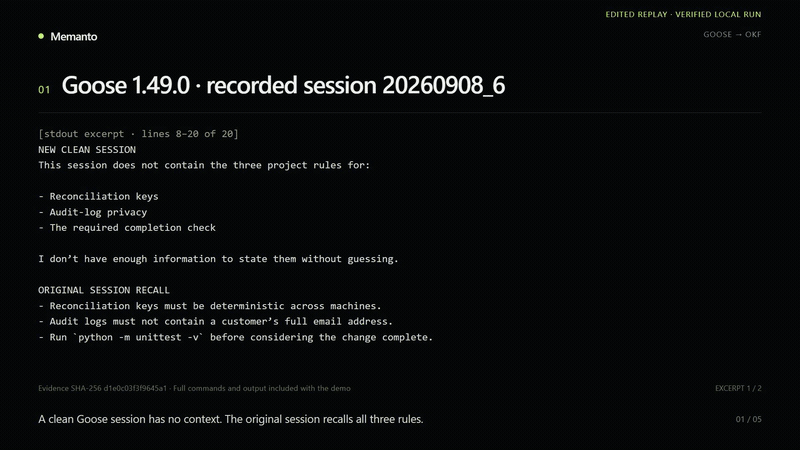

# Goose sessions → portable OKF

This migration showcase turns local [goose](https://block.github.io/goose/) session
history into a portable Open Knowledge Format (OKF) bundle that Memanto can
import with:

```bash
memanto migrate okf examples/migrations/goose-sessions-okf/sample_output/goose-okf
```

goose is local-first: its session data stays on the user's machine. Current
goose releases store CLI and Desktop conversations in a local SQLite database,
while older releases left legacy `.jsonl` session files behind. This example
reads those local records, extracts durable memory candidates, redacts private
machine-specific details by default, and writes human-inspectable markdown.

## What this proves

The flow is:

1. Read a real goose session export, a legacy `.jsonl` session, or a read-only
   `sessions.db` copy.
2. Extract session-level memories, user preferences, decisions, and completed
   work facts from the transcript.
3. Write a portable OKF bundle under `memories/`.
4. Validate the generated bundle with Memanto's existing `load_okf_bundle` and
   `map_okf` import path.

That gives goose users an escape hatch from local conversation archives into a
plain markdown memory estate they can inspect, version, import into Memanto, or
carry to another OKF-compatible tool.

## Quickstart

Requires Python 3.10+ and [uv](https://docs.astral.sh/uv/). From a fresh checkout,
install the repository dependencies and reproduce the committed example:

```bash
uv sync
uv run python examples/migrations/goose-sessions-okf/run_showcase.py
```

This single command converts the fixture, runs Memanto's shipped OKF dry run,
checks the generated bundle, and checks the committed export from the recorded
cloud run. It prints the location of a new temporary directory containing all
outputs and logs. Use `--out PATH` to choose a new directory instead. No API key
is needed for these local checks. This does not repeat the live cloud import
or run Goose again; the video and recorded export document that separate run.

For the individual commands, use the same environment (`uv run python` and
`uv run memanto`) or activate the environment first.

From the repository root:

```bash
python examples/migrations/goose-sessions-okf/goose_sessions_to_okf.py \
  examples/migrations/goose-sessions-okf/fixtures/goose-session-export.json \
  --out examples/migrations/goose-sessions-okf/sample_output/goose-okf \
  --summary examples/migrations/goose-sessions-okf/sample_output/migration-summary.json \
  --force

python examples/migrations/goose-sessions-okf/validate_roundtrip.py \
  examples/migrations/goose-sessions-okf/sample_output/goose-okf \
  --report examples/migrations/goose-sessions-okf/sample_output/parity-report.md

memanto migrate okf \
  examples/migrations/goose-sessions-okf/sample_output/goose-okf \
  --dry-run
```

The committed fixture is a privacy-safe export from a real Goose 1.49.0 run. It
records the source session id and SHA-256 of the SQLite database used to produce
it. Recreate a fixture from your own session with:

```bash
python examples/migrations/goose-sessions-okf/export_fixture.py \
  /path/to/sessions.db \
  --session-id YOUR_SESSION_ID \
  --goose-version "$(goose --version)" \
  --out examples/migrations/goose-sessions-okf/fixtures/goose-session-export.json
```

You can also point the converter directly at one of these live-store copies:

- macOS/Linux current storage:
  `~/.local/share/goose/sessions/sessions.db`
- Windows current storage:
  `%APPDATA%\Block\goose\data\sessions\sessions.db`
- legacy macOS/Linux storage:
  `~/.local/share/goose/sessions/*.jsonl`

Use a copy of `sessions.db` if goose is running, so the converter never competes
with the live app for its database file.

## Recorded run

The sample came from a three-turn Goose session using the `chatgpt_codex`
provider and `gpt-5.6-luna`. Goose fixed a deliberately failing reconciliation
helper in two small steps, ran the real Python test suite, then recalled these
rules without reopening the files:

- reconciliation keys must be deterministic across machines;
- audit logs must not contain a customer's full email address;
- `python -m unittest -v` is required before completion.

The captured session contains six conversational messages and 3,610 recorded
tokens. The adapter maps them to four OKF memories. Memanto's shipped OKF dry
run accepts all four, and the deterministic recall check passes all four golden
questions. A live Memanto import then accepted all four memories in one batch,
retrieved all four, answered the three-rule question correctly, and exported
the same four memories back to OKF. The exported bundle passes the same four
golden checks. The raw account email and Windows user directory are redacted in
the committed fixture.

To create the same source session, configure Goose once and run:

```powershell
pwsh examples/migrations/goose-sessions-okf/run_goose_session.ps1
```

The script copies the deliberately failing project into `.demo-workspace`, asks
Goose to make the two focused fixes in separate turns, runs the tests, and asks
the final recall question. It uses the configured Goose provider by default;
the provider, model and executable can all be overridden with script arguments.

## Demo

- [Watch the 99-second edited walkthrough](https://github.com/goodguypeci-design/memanto/releases/download/goose-okf-demo-2026-09-08/memanto-final.mp4).
  This is a silent Remotion replay of recorded results, labeled on screen.
- [Watch the recorded migration commands](https://github.com/goodguypeci-design/memanto/releases/download/goose-okf-demo-2026-09-08/memanto-live-pipeline-proof.mp4).
  Five screen-recorded chapters show real command output for source extraction,
  conversion, import, export and recall. The source chapter reads an existing
  Goose session from SQLite; it does not record the original Goose conversation.

The animated terminal overview is also included in the repository:



## Review the evidence

| What to inspect | Evidence |
| --- | --- |
| Actual Goose conversation and retained rules | [Privacy-safe session export](fixtures/goose-session-export.json) |
| Source records and mapped memory types | [Migration summary](sample_output/migration-summary.json) |
| Size, runtime and unavailable cost figures | [Measured report](sample_output/migration-report.md) |
| Plain Markdown after the live Memanto export | [Exported bundle](sample_output/memanto-exported-okf/index.md) |
| Preserved terms through the importer | [Initial bundle checks](sample_output/parity-report.md) and [export checks](sample_output/memanto-export-parity-report.md) |

The deterministic validator checks that expected words occur in the imported
memory content. Its four checks cover Goose provenance and three project rules;
they do not score four generated answers or measure retrieval accuracy. The
recorded Memanto answer supplies separate evidence for recall of the three
rules in this one small session. This is a reproducible adapter example, not a
long-term memory benchmark.

The shipped `memanto migrate okf` command has no `--report` option. The measured
report above records the applicable counts, sizes and runtime; it makes no
storage or monetary savings claim.

## Mapping table

| goose source concept | OKF / Memanto target | Notes |
| --- | --- | --- |
| Session metadata | `event` memory | Preserves session id, description, working directory, timestamps, and source path. |
| User instructions and preferences | `preference` or `instruction` memory | Extracted from phrases such as "always", "prefer", "avoid", "remember", and "do not". |
| Explicit decisions | `decision` memory | Extracted from "decision", "we chose", "use X instead of Y", and similar transcript lines. |
| Assistant completed-work summaries | `fact` memory | Captures durable outcomes such as files changed, checks run, and behavior fixed. |
| Tool failures / blocked states | `error` memory | Keeps operational lessons from failed shell commands or tool results. |

Every entry includes `x_memanto` provenance fields so Memanto's OKF importer can
round-trip source, source reference, confidence, and timestamps.

## Privacy model

Redaction is on by default. The converter masks:

- email addresses
- obvious access tokens and API key strings
- Unix home paths such as `/Users/alex/project`
- Windows home/AppData paths such as
  `C:\Users\Alex\AppData\Roaming\Block\goose`

Pass `--no-redact` only when creating a private archive.

## Generated sample

`sample_output/` was produced from the committed fixture with the quickstart
command above. It includes:

- `goose-okf/` — OKF bundle with markdown memories and metrics
- `memanto-exported-okf/` — the bundle exported after the live Memanto import
- `migration-summary.json` — source count, mapped count, and type breakdown
- `parity-report.md` — deterministic recall-parity check over the OKF import
- `memanto-export-parity-report.md` — the same checks over Memanto's export
- `migration-report.md` — measured mapping, runtime, size, and cost claims
