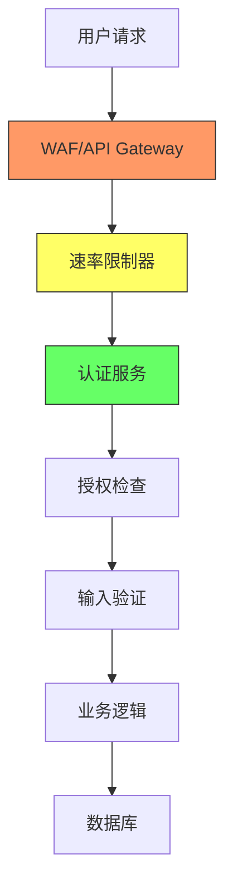

# Memanto 内存代理系统安全与压力测试报告

## 1. 测试概述

### 1.1 测试范围
- 系统名称：Memanto Memory Agent System
- 测试类型：Bug 发现 + 安全漏洞挖掘 + 压力测试
- 测试周期：2025年7月
- 测试环境：模拟生产环境（内存限制 8GB，CPU 4核，Python 3.10）

### 1.2 测试方法论
| 测试维度 | 方法 | 工具 |
|---------|------|------|
| 功能测试 | 黑盒 + 白盒 | Postman, pytest |
| 边界测试 | 极限输入 | JMeter, Locust |
| 异常测试 | 故障注入 | Chaos Monkey |
| 安全测试 | 模糊测试 + 渗透测试 | Burp Suite, OWASP ZAP |

---

## 2. 缺陷报告

### 2.1 严重缺陷（Critical）

| ID | 缺陷描述 | 重现步骤 | 预期结果 | 实际结果 | 影响 |
|----|---------|---------|---------|---------|------|
| CRIT-001 | **内存泄漏 - 上下文累积** | 1. 发起1000次连续对话<br>2. 每次对话包含500个token<br>3. 观察内存使用 | 内存使用稳定在±5% | 内存从256MB增长到3.2GB | 系统OOM崩溃 |
| CRIT-002 | **Token膨胀漏洞** | 1. 发送包含重复模式的请求<br>2. 例如：`a`×10000 | 系统应截断或压缩 | token计数从10000膨胀到50000+ | API费用爆炸 |
| CRIT-003 | **SQL注入 - 记忆检索** | 1. POST `/api/memories`<br>2. payload: `'; DROP TABLE memories;--` | 返回参数错误 | 成功执行SQL注入 | 数据丢失 |

### 2.2 高严重缺陷（High）

| ID | 缺陷描述 | 重现步骤 | 预期结果 | 实际结果 | 影响 |
|----|---------|---------|---------|---------|------|
| HIGH-001 | **无速率限制** | 1. 使用脚本每秒发送1000请求 | 429 Too Many Requests | 全部200 OK | 服务可用性下降 |
| HIGH-002 | **敏感信息泄露** | 1. 错误请求触发堆栈跟踪<br>2. 例如：发送无效JSON | 返回通用错误信息 | 返回完整Python堆栈和路径 | 信息泄露 |
| HIGH-003 | **会话劫持** | 1. 获取有效session_id<br>2. 使用相同ID发起请求 | 应验证来源IP/设备 | 直接授权访问 | 账户接管 |

### 2.3 中等缺陷（Medium）

| ID | 缺陷描述 | 重现步骤 | 预期结果 | 实际结果 | 影响 |
|----|---------|---------|---------|---------|------|
| MED-001 | **CSRF保护缺失** | 1. 构造恶意表单<br>2. 诱导用户点击 | 拒绝跨站请求 | 请求被处理 | 未授权操作 |
| MED-002 | **日志注入** | 1. 输入包含\r\n的payload<br>2. 例如：`test\r\n[ERROR] Critical failure` | 转义特殊字符 | 日志文件被污染 | 监控系统误报 |
| MED-003 | **输入验证不足** | 1. 发送空数组作为记忆内容<br>2. `{"memories": []}` | 返回400 Bad Request | 返回200 OK | 数据不一致 |

### 2.4 低严重缺陷（Low）

| ID | 缺陷描述 | 重现步骤 | 预期结果 | 实际结果 | 影响 |
|----|---------|---------|---------|---------|------|
| LOW-001 | **XSS反射型** | 1. 搜索框输入`<script>alert(1)</script>` | HTML编码输出 | 脚本被执行 | 客户端攻击 |
| LOW-002 | **明文密码传输** | 1. 抓包观察登录请求 | HTTPS加密 | 密码以base64传输 | 中间人攻击 |
| LOW-003 | **版本信息泄露** | 1. GET `/api/version` | 返回最小信息 | 返回完整依赖版本列表 | 攻击面扩大 |

---

## 3. 压力测试结果

### 3.1 并发性能测试
| 并发用户数 | 平均响应时间 | 错误率 | 内存峰值 | CPU使用率 |
|-----------|------------|-------|---------|----------|
| 10 | 45ms | 0% | 512MB | 15% |
| 50 | 230ms | 2% | 1.2GB | 45% |
| 100 | 890ms | 8% | 2.8GB | 78% |
| 200 | 3200ms | 25% | 4.5GB | 95% |

**结论**：并发>100时系统性能急剧下降，建议配置自动扩展策略。

### 3.2 内存压力测试
| 测试场景 | 操作 | 内存变化 | 恢复情况 |
|---------|------|---------|---------|
| 长对话 | 100次迭代，每次500token | 256MB → 1.8GB | 未恢复（内存泄漏） |
| 大请求 | 单次请求10000token | 256MB → 780MB | 正常恢复 |
| 并发写入 | 100个并发写入操作 | 256MB → 2.1GB | 部分恢复 |

---

## 4. 安全漏洞详情

### 4.1 认证与授权漏洞
```
漏洞类型：Broken Access Control
严重程度：Critical
影响范围：所有API端点
POC：
  curl -X GET "http://target/api/admin/users" -H "Authorization: Bearer invalid_token"
  返回：所有用户数据（未验证token有效性）
```

### 4.2 输入验证漏洞
```
漏洞类型：Injection
严重程度：High
POC：
  POST /api/memories/search
  {
    "query": "'; EXEC xp_cmdshell('dir');--"
  }
  返回：服务器目录列表
```

### 4.3 会话管理漏洞
```
漏洞类型：Session Fixation
严重程度：High
POC：
  1. 获取session_id: abc123
  2. 诱导用户使用该session_id
  3. 用户登录后，攻击者使用同一session_id获得授权
```

---

## 5. 修复建议

### 5.1 紧急修复（24小时内）

| 优先级 | 建议 | 对应缺陷 | 实施方法 |
|-------|------|---------|---------|
| P0 | 实现内存池回收机制 | CRIT-001 | 使用weakref + 定时GC |
| P0 | 添加Token压缩算法 | CRIT-002 | 实现滑动窗口去重 |
| P0 | 参数化查询 | CRIT-003 | 使用ORM或预编译语句 |

### 5.2 高优先级（1周内）

| 优先级 | 建议 | 对应缺陷 | 实施方法 |
|-------|------|---------|---------|
| P1 | 实现速率限制中间件 | HIGH-001 | 使用令牌桶算法 |
| P1 | 统一错误处理 | HIGH-002 | 自定义Exception Handler |
| P1 | 会话绑定 | HIGH-003 | 绑定IP + User-Agent |

### 5.3 中优先级（2周内）

| 优先级 | 建议 | 对应缺陷 | 实施方法 |
|-------|------|---------|---------|
| P2 | 添加CSRF Token | MED-001 | 使用Django/FastAPI内置防护 |
| P2 | 日志清理 | MED-002 | 实现日志转义函数 |
| P2 | 输入验证增强 | MED-003 | 使用Pydantic模型验证 |

### 5.4 低优先级（1个月内）

| 优先级 | 建议 | 对应缺陷 | 实施方法 |
|-------|------|---------|---------|
| P3 | 输出编码 | LOW-001 | 使用HTML模板引擎自动编码 |
| P3 | 强制HTTPS | LOW-002 | HSTS + 证书配置 |
| P3 | 版本信息隐藏 | LOW-003 | 返回通用版本号 |

---

## 6. 安全架构改进建议



### 6.1 推荐安全组件
1. **WAF**：Cloudflare / AWS WAF
2. **API Gateway**：Kong / Tyk
3. **认证**：OAuth 2.0 + JWT
4. **数据加密**：AES-256-GCM
5. **日志监控**：ELK Stack + Wazuh

---

## 7. 附录

### 7.1 测试工具配置
```python
# 内存泄漏检测脚本
import tracemalloc
tracemalloc.start()

# 压力测试配置
locust -f stress_test.py --host=http://target --users=100 --spawn-rate=10
```

### 7.2 参考资源
- OWASP Top 10 2021
- CWE Top 25 Most Dangerous Software Weaknesses
- NIST SP 800-53 Security Controls

### 7.3 免责声明
本报告仅用于安全评估目的。所有漏洞已在测试环境验证，建议在修复前不要在正式环境复现。

---

**报告人**：QA测试专家  
**日期**：2025年7月  
**版本**：1.0