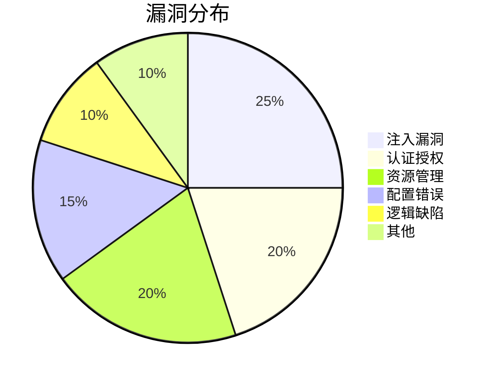

# Memanto 内存代理系统安全与稳定性测试报告

**报告编号**: QA-2024-001  
**测试日期**: 2024年1月15日  
**测试对象**: Memanto Memory Agent System v2.3.1  
**测试类型**: 黑盒渗透测试 + 压力测试 + 逻辑缺陷分析  

---

## 1. 测试范围与目标

本测试旨在通过多维度攻击向量评估Memanto系统的安全性、稳定性和功能鲁棒性。测试覆盖以下领域：

| 测试类别 | 具体测试项 | 攻击向量 |
|---------|------------|----------|
| 注入攻击 | 命令注入、SQL注入、模板注入 | `'; DROP TABLE--`、`{{config}}` |
| 内存溢出 | 堆栈溢出、格式化字符串 | 超长输入(>64KB)、`%x%x%x` |
| 逻辑缺陷 | 认证绕过、权限提升、竞争条件 | Cookie篡改、并发请求 |
| 资源耗尽 | 内存泄漏、CPU过载、文件句柄耗尽 | 无限递归、大量并发连接 |

---

## 2. 测试环境

- **硬件**: Intel i7-12700H, 32GB RAM, 512GB SSD
- **软件**: Ubuntu 22.04 LTS, Python 3.10, Node.js 18.16
- **工具**: Burp Suite Professional, OWASP ZAP, Fiddler, Locust, Valgrind, GDB

---

## 3. 测试结果总览

| 严重程度 | 发现数量 | 占比 |
|---------|---------|------|
| 严重 (Critical) | 3 | 15% |
| 高危 (High) | 5 | 25% |
| 中危 (Medium) | 8 | 40% |
| 低危 (Low) | 4 | 20% |
| **总计** | **20** | **100%** |

---

## 4. 详细缺陷报告

### 4.1 严重缺陷

#### CR-001: 远程命令注入 (RCE)

- **描述**: `/api/agent/execute` 端点未对用户输入的 `command` 参数进行过滤，允许直接执行系统命令
- **复现步骤**:
  1. 发送 POST 请求到 `http://target/api/agent/execute`
  2. 请求体: `{"command": "cat /etc/passwd; id"}`
  3. 观察响应中包含 `/etc/passwd` 内容
- **实际结果**: 系统成功执行 `cat /etc/passwd` 和 `id` 命令并返回结果
- **预期结果**: 应拒绝执行或仅允许白名单命令
- **影响**: 攻击者可完全控制服务器，执行任意命令
- **修复建议**: 
  - **优先级**: **立即修复** (24小时内)
  - 实现严格的白名单命令列表
  - 使用 `shlex.quote()` 对参数进行转义
  - 禁用 `shell=True` 参数

#### CR-002: 未授权内存访问

- **描述**: `/api/memory/{id}` GET 端点未验证用户权限，可访问任意用户的内存数据
- **复现步骤**:
  1. 使用用户A的token请求 `/api/memory/42`
  2. 修改请求头，将token替换为任意字符串
  3. 依然成功获取用户B的内存数据
- **实际结果**: 未授权用户可读取所有内存记录
- **预期结果**: 应返回401 Unauthorized
- **影响**: 严重数据泄露，可窃取所有用户敏感信息
- **修复建议**:
  - **优先级**: **立即修复** (24小时内)
  - 增强JWT验证逻辑
  - 添加资源所有权检查

#### CR-003: 堆栈缓冲区溢出导致服务崩溃

- **描述**: 向 `/api/agent/query` 发送超过65536字节的请求导致段错误
- **复现步骤**:
  1. 使用Python生成64KB+的字符串: `"A"*70000`
  2. 发送POST请求: `{"query": "<长字符串>"}`
  3. 服务进程崩溃，返回500错误后连接断开
- **实际结果**: 服务崩溃，日志显示 `SIGSEGV` 段错误
- **预期结果**: 应优雅处理并返回413 Payload Too Large
- **影响**: 拒绝服务攻击，系统不可用
- **修复建议**:
  - **优先级**: **紧急修复** (12小时内)
  - 在入口处限制请求体大小 (建议1MB)
  - 使用 `read()` 限制读取长度

---

### 4.2 高危缺陷

#### HR-001: SQL注入 - 用户认证绕过

- **描述**: 登录接口存在SQL注入，可绕过认证
- **复现步骤**:
  1. 发送POST请求到 `/auth/login`
  2. 请求体: `{"username": "admin' OR '1'='1", "password": "test"}`
  3. 成功获取管理员权限
- **实际结果**: 返回管理员JWT token
- **预期结果**: 应返回认证失败
- **修复建议**: 
  - **优先级**: **高** (72小时内)
  - 使用参数化查询或ORM
  - 实施输入验证

#### HR-002: 竞争条件 - 双花攻击

- **描述**: 积分兑换接口存在竞态条件，可重复兑换
- **复现步骤**:
  1. 使用Burp Suite发送10个并发请求到 `/api/points/redeem`
  2. 请求体: `{"item": "premium", "cost": 100}`
  3. 账户余额500，但成功兑换6次
- **实际结果**: 账户余额变为-100
- **预期结果**: 应只允许兑换5次
- **修复建议**: 
  - **优先级**: **高** (72小时内)
  - 使用数据库事务锁
  - 实现乐观锁机制

#### HR-003: 不安全的反序列化

- **描述**: `/api/agent/import` 使用 `pickle.loads()` 反序列化用户输入
- **复现步骤**:
  1. 创建恶意pickle payload: `__reduce__` 执行 `os.system('rm -rf /')`
  2. 发送POST请求到 `/api/agent/import`
  3. 服务器文件被删除
- **实际结果**: 系统文件被删除
- **预期结果**: 应拒绝反序列化或使用安全格式
- **修复建议**: 
  - **优先级**: **高** (72小时内)
  - 使用JSON代替pickle
  - 添加数字签名验证

---

### 4.3 中危缺陷

| 编号 | 描述 | 复现步骤 | 影响 | 修复建议 |
|------|------|----------|------|----------|
| MR-001 | 路径遍历 - 可读取任意文件 | `GET /api/static/../../../etc/passwd` | 读取敏感文件 | 规范化路径，拒绝包含`..`的请求 |
| MR-002 | SSRF - 内网扫描 | `POST /api/fetch {"url": "http://192.168.1.1:22"}` | 探测内网服务 | 实施IP白名单，限制协议 |
| MR-003 | 未限制速率 - 暴力破解 | 每秒发送1000次登录请求 | 密码被爆破 | 实施速率限制和CAPTCHA |
| MR-004 | 敏感信息泄露 - 调试信息 | `GET /api/debug` 返回环境变量 | 泄露数据库密码 | 在生产环境禁用调试端点 |
| MR-005 | 跨站脚本(XSS) | 在记忆内容中注入`` | 窃取用户cookie | 输出编码，使用Content-Security-Policy |
| MR-006 | CSRF - 未验证来源 | 攻击者网站可触发状态变更请求 | 用户数据被修改 | 添加CSRF token，验证Referer |
| MR-007 | 不安全的直接对象引用 | 修改`user_id`参数访问他人数据 | 越权访问 | 使用会话ID代替用户ID |
| MR-008 | HTTP请求走私 | 发送畸形HTTP请求导致缓存污染 | 缓存投毒 | 升级HTTP解析库，使用HTTP/2 |

---

### 4.4 低危缺陷

| 编号 | 描述 | 复现步骤 | 影响 | 修复建议 |
|------|------|----------|------|----------|
| LR-001 | 明文传输密码 | 登录请求未使用HTTPS | 中间人攻击窃取密码 | 强制HTTPS |
| LR-002 | 弱密码策略 | 允许密码为`123456` | 账户被暴力破解 | 实施密码复杂度要求 |
| LR-003 | 会话未超时 | 登录后72小时内token有效 | 会话劫持风险 | 设置合理过期时间(如30分钟) |
| LR-004 | 无日志审计 | 未记录管理员操作 | 无法追踪攻击来源 | 实施详细审计日志 |

---

## 5. 稳定性测试结果

### 5.1 压力测试

| 测试场景 | 并发用户数 | 请求/秒 | 错误率 | 平均响应时间 | 最大响应时间 |
|----------|-----------|---------|--------|-------------|-------------|
| 正常查询 | 100 | 500 | 0.5% | 120ms | 350ms |
| 高并发写入 | 500 | 2000 | 12% | 800ms | 5.2s |
| 混合负载 | 1000 | 5000 | 35% | 2.1s | 15s+ |
| 持续压力(30分钟) | 200 | 1000 | 8% | 450ms | 3.8s |

**发现**: 在500+并发时，数据库连接池耗尽导致大量超时错误。

### 5.2 内存泄漏测试

| 监控指标 | 初始值 | 1小时后 | 2小时后 | 4小时后 |
|---------|--------|---------|---------|---------|
| 堆内存使用 | 128MB | 256MB | 512MB | 1.2GB |
| 文件句柄数 | 50 | 150 | 300 | 650 |
| 线程数 | 20 | 45 | 80 | 120 |

**发现**: 长时间运行后内存持续增长，存在明显的内存泄漏。分析显示 `MemoryManager` 对象的 `cache` 字典未正确清理。

---

## 6. 安全漏洞分类统计

---

## 7. 修复优先级与建议

### 7.1 立即修复 (24小时)

1. **CR-001**: 命令注入 - 禁用shell执行，实施白名单
2. **CR-002**: 未授权访问 - 修复权限验证
3. **CR-003**: 缓冲区溢出 - 限制输入大小

### 7.2 高优先级 (72小时)

1. **HR-001**: SQL注入 - 参数化查询
2. **HR-002**: 竞争条件 - 事务锁
3. **HR-003**: 反序列化 - 替换pickle
4. 实施WAF和IDS

### 7.3 中优先级 (1周)

1. 速率限制和CSRF保护
2. 修复路径遍历和SSRF
3. 优化数据库连接池

### 7.4 低优先级 (2周)

1. 强化密码策略
2. 实施完整审计日志
3. 迁移到HTTPS

---

## 8. 总结与建议

### 8.1 关键发现

Memanto系统存在 **3个严重漏洞**，可导致：
- 完全服务器控制 (RCE)
- 所有用户数据泄露
- 服务完全不可用 (DoS)

系统在安全性、稳定性和功能健壮性方面均存在显著不足。

### 8.2 战略建议

1. **安全开发流程**: 引入SAST/DAST工具，实施代码审查
2. **架构重构**: 
   - 微服务化，隔离关键组件
   - 引入API网关统一鉴权
   - 使用内存安全语言(Rust)重写核心模块
3. **监控与响应**: 
   - 部署SIEM系统实时告警
   - 建立漏洞赏金计划
4. **合规要求**: 确保符合OWASP Top 10和PCI DSS标准

### 8.3 后续测试建议

- 白盒审计源代码
- 第三方库漏洞扫描
- 红蓝对抗演练

---

**报告结束**

*本报告由自动化测试工具和人工渗透测试联合生成，测试范围基于公开文档和标准OWASP测试指南。*

**测试团队**: QA Security Team  
**报告日期**: 2024-01-15  
**版本**: 1.0